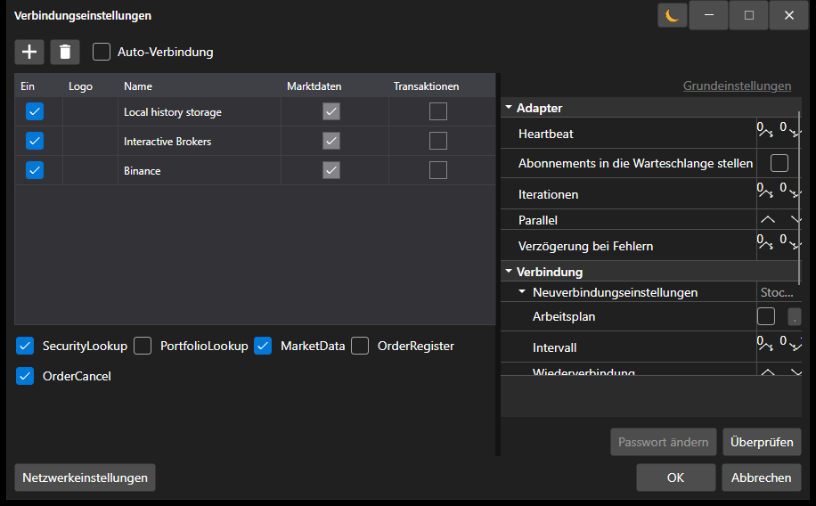

# Konnektoren

Für die Arbeit mit Börsen und Datenquellen in [S#](../api.md) wird empfohlen, die Basisklasse [Connector](xref:StockSharp.Algo.Connector) zu verwenden.

Schauen wir uns die Arbeit mit [Connector](xref:StockSharp.Algo.Connector) an. Der Quellcode des Beispiels befindet sich im Projekt Samples\/01\_Basic\/01\_ConnectAndDownloadInstruments.


Erstellen Sie eine Instanz der Klasse [Connector](xref:StockSharp.Algo.Connector):

```cs
...
public Connector Connector;
...
public MainWindow()
{
	InitializeComponent();
	Connector = new Connector();
	InitConnector();
}

```

Zur Konfiguration von [Connector](xref:StockSharp.Algo.Connector) verfügt die **API** über eine spezielle grafische Oberfläche, mit der Sie mehrere Verbindungen gleichzeitig konfigurieren können. Wie man sie verwendet, wird im Abschnitt [Grafische Konfiguration](connectors/graphical_configuration.md) beschrieben.

```cs
...
private readonly IFileSystem _fileSystem = Paths.FileSystem;
private const string _connectorFile = "ConnectorFile.json";
...
private void Setting_Click(object sender, RoutedEventArgs e)
{
	if (Connector.Configure(this))
	{
		Connector.Save().Serialize(_fileSystem, _connectorFile);
	}
}

```



Ebenso können Sie Verbindungen direkt aus dem Code (ohne grafische Fenster) hinzufügen, indem Sie die Erweiterungsmethode [TraderHelper.AddAdapter\<TAdapter\>](xref:StockSharp.Algo.TraderHelper.AddAdapter``1(StockSharp.Algo.Connector,System.Action{``0}))**(**[StockSharp.Algo.Connector](xref:StockSharp.Algo.Connector) connector, [System.Action\<TAdapter\>](xref:System.Action`1) init **)** verwenden:

```cs
...
// Adapter für die Verbindung zu Binance hinzufügen
connector.AddAdapter<BinanceMessageAdapter>(a =>
{
	a.Key = "<Your API Key>";
	a.Secret = "<Your Secret Key>";
});

// RSS für Nachrichten hinzufügen
connector.AddAdapter<RssMessageAdapter>(a =>
{
	a.Address = "https://news-source.com/feed";
});

```

Sie können einer einzelnen [Connector](xref:StockSharp.Algo.Connector)-Instanz eine unbegrenzte Anzahl von Verbindungen hinzufügen. So können Sie sich gleichzeitig von einem Programm aus mit mehreren Börsen und Brokern verbinden.

In der Methode *InitConnector* legen wir die erforderlichen Event-Handler für [IConnector](xref:StockSharp.BusinessEntities.IConnector) fest:

```cs
private void InitConnector()
{
	// Ereignis für erfolgreiche Verbindung abonnieren
	Connector.Connected += () =>
	{
		this.GuiAsync(() => ChangeConnectStatus(true));
	};

	// Verbindungsfehlerereignis abonnieren
	Connector.ConnectionError += error => this.GuiAsync(() =>
	{
		ChangeConnectStatus(false);
		MessageBox.Show(this, error.ToString(), LocalizedStrings.ErrorConnection);
	});

	// Trennungsereignis abonnieren
	Connector.Disconnected += () => this.GuiAsync(() => ChangeConnectStatus(false));

	// Fehlerereignis abonnieren
	Connector.Error += error =>
		this.GuiAsync(() => MessageBox.Show(this, error.ToString(), LocalizedStrings.Str2955));

	// Ereignis für fehlgeschlagenes Marktdatenabonnement abonnieren
	Connector.SubscriptionFailed += (subscription, error, isSubscribe) =>
		this.GuiAsync(() => MessageBox.Show(this, error.ToString(),
			LocalizedStrings.Str2956Params.Put(subscription.DataType, subscription.SecurityId)));

	// Abonnements zum Datenempfang

	// Instruments
	Connector.SecurityReceived += (sub, security) => _securitiesWindow.SecurityPicker.Securities.Add(security);

	// Tick trades
	Connector.TickTradeReceived += (sub, trade) => _tradesWindow.TradeGrid.Trades.TryAdd(trade);

	// Orders
	Connector.OrderReceived += (sub, order) => _ordersWindow.OrderGrid.Orders.TryAdd(order);

	// Own trades
	Connector.OwnTradeReceived += (sub, trade) => _myTradesWindow.TradeGrid.Trades.TryAdd(trade);

	// Positions
	Connector.PositionReceived += (sub, position) => _portfoliosWindow.PortfolioGrid.Positions.TryAdd(position);

	// Fehler bei der Orderregistrierung
	Connector.OrderRegisterFailReceived += (sub, fail) => _ordersWindow.OrderGrid.AddRegistrationFail(fail);

	// Fehler bei der Orderstornierung
	Connector.OrderCancelFailReceived += (sub, fail) => OrderFailed(fail);

	// Marktdatenprovider festlegen
	_securitiesWindow.SecurityPicker.MarketDataProvider = Connector;

	try
	{
		if (File.Exists(_connectorFile))
		{
			var ctx = new ContinueOnExceptionContext();
			ctx.Error += ex => ex.LogError();
			using (new Scope<ContinueOnExceptionContext>(ctx))
				Connector.Load(_connectorFile.Deserialize<SettingsStorage>(_fileSystem));
		}
	}
	catch
	{
	}

	ConfigManager.RegisterService<IExchangeInfoProvider>(new InMemoryExchangeInfoProvider());

	// Adapterprovider für grafische Konfiguration registrieren
	ConfigManager.RegisterService<IMessageAdapterProvider>(
		new InMemoryMessageAdapterProvider(Connector.Adapter.InnerAdapters));
}
```

Wie man Einstellungen für [Connector](xref:StockSharp.Algo.Connector) in einer Datei speichert und lädt, finden Sie im Abschnitt [Einstellungen speichern und laden](connectors/save_and_load_settings.md).

Informationen zur Erstellung eines eigenen [Connector](xref:StockSharp.Algo.Connector) finden Sie im Abschnitt [Erstellung eines eigenen Connectors](connectors/creating_own_connector.md).

Die Auftragserteilung wird in den Abschnitten [Orders](orders_management.md), [Erstellung einer neuen Order](orders_management/create_new_order.md), [Erstellung einer neuen Stop-Order](orders_management/create_new_stop_order.md) beschrieben.

## Zusätzliche Funktionen

### IFileSystem und Paths.FileSystem

Verwenden Sie `IFileSystem` für Dateioperationen wie das Serialisieren und Deserialisieren von Einstellungen. Die Standardinstanz ist über `Paths.FileSystem` verfügbar:

```cs
private readonly IFileSystem _fileSystem = Paths.FileSystem;
```

Die Methoden `Serialize` und `Deserialize` ohne den Parameter `IFileSystem` sind als `[Obsolete]` markiert.

### Asynchrone Order-Methoden

Für die Arbeit mit Orders stehen folgende asynchrone Methoden zur Verfügung:

- `RegisterOrderAsync` - registriert eine Order asynchron.
- `CancelOrderAsync` - storniert eine Order asynchron.
- `EditOrderAsync` - bearbeitet eine Order asynchron.

### SubscriptionsOnConnect

Die Eigenschaft `SubscriptionsOnConnect` steuert die Abonnements, die beim Verbinden automatisch ausgeführt werden. Standardmäßig umfasst sie Abonnements für Instrumente, Portfolios und Orders.

### Adapter-Ereignisse

Für die Verfolgung von Ereignissen bestimmter Adapter stehen folgende Ereignisse zur Verfügung:

- `ConnectedEx` - ein bestimmter Adapter hat sich verbunden.
- `DisconnectedEx` - ein bestimmter Adapter hat die Verbindung getrennt.
- `ConnectionErrorEx` - bei einem bestimmten Adapter ist ein Verbindungsfehler aufgetreten.

### Lebenszyklus des Abonnements

- `SubscriptionStarted` - das Abonnement wurde gestartet.
- `SubscriptionOnline` - das Abonnement ist in den Online-Zustand gewechselt: historische Daten wurden empfangen, und die Echtzeit-Datenübertragung hat begonnen.
- `SubscriptionFailed` - Abonnementfehler. Der dritte Parameter, `isSubscribe`, gibt an, ob der Fehler beim Abonnieren oder Kündigen aufgetreten ist.
- `SubscriptionStopped` - das Abonnement wurde gestoppt.

## Siehe auch

[Grafische Konfiguration](connectors/graphical_configuration.md)
