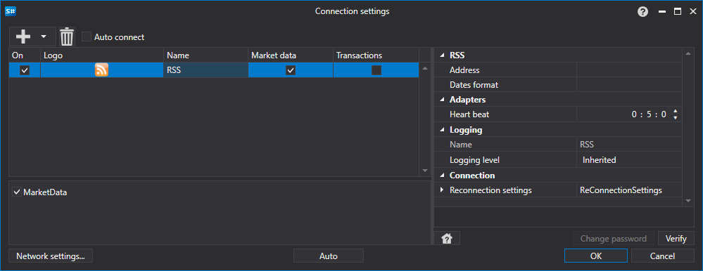

# Grafische Konfiguration RSS

Für alle [S#](../../../../api.md)-Produkte erfolgt die grafische Konfiguration der Verbindung im [Fenster für Verbindungseinstellungen](../../../graphical_user_interface/connection_settings_window.md):

- **Adresse** - Adresse des RSS-Feeds.
- **Dates format** - Datumsformat. Erforderlich, wenn das Format des RSS-Streams von `ddd, dd MMM yyyy HH:mm:ss zzzz` abweicht.
- **Verbindungsprüfung** - Intervall der Serverüberprüfung, um sicherzustellen, dass die Verbindung aktiv ist. Standardmäßig 1 Minute.
- **Einstellungen für die Wiederverbindung** - Mechanismus zur Überwachung der Verbindungseinstellungen mit dem Handelssystem. ([Wiederverbindungseinstellungen](../../reconnection_settings.md))

## Empfohlener Inhalt

[Konnektoren](../../../connectors.md)

[Grafische Konfiguration](../../graphical_configuration.md)

[Erstellung eines eigenen Connectors](../../creating_own_connector.md)

[Einstellungen speichern und laden](../../save_and_load_settings.md)
