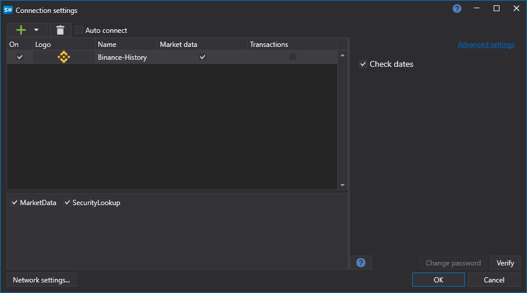

# Grafische Konfiguration Binance History

Für alle [S#](../../../../api.md)-Produkte erfolgt die grafische Konfiguration der Verbindung im [Fenster für Verbindungseinstellungen](../../../graphical_user_interface/connection_settings_window.md):

- **Datumsangaben prüfen** - Überprüft angeforderte Daten, bevor Anfragen zum Herunterladen gesendet werden.
