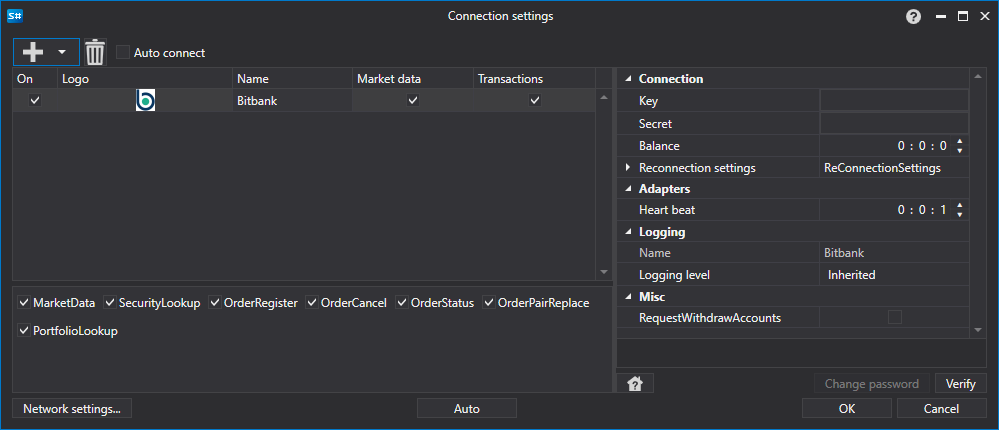

# Grafische Konfiguration Bitbank

Für alle [S#](../../../../api.md)-Produkte erfolgt die grafische Konfiguration der Verbindung im [Fenster für Verbindungseinstellungen](../../../graphical_user_interface/connection_settings_window.md):

- **Schlüssel** - Schlüssel.
- **Geheimnis** - Geheimnis.
- **Balance** - Intervall der Guthabenprüfung. Erforderlich bei Einzahlungs- und Auszahlungsvorgängen.
- **Verbindungsprüfung** - Intervall der Serverüberprüfung, um zu verfolgen, dass die Verbindung aktiv ist. Standardmäßig beträgt es 1 Minute.
- **Einstellungen für die Wiederverbindung** - Mechanismus zur Verfolgung von Verbindungen mit den Einstellungen des Handelssystems. ([Wiederverbindungseinstellungen](../../reconnection_settings.md))
- **RequestWithdrawAccounts** - RequestWithdrawAccounts

## Empfohlener Inhalt

[Konnektoren](../../../connectors.md)

[Grafische Konfiguration](../../graphical_configuration.md)

[Erstellen eines eigenen Connectors](../../creating_own_connector.md)

[Einstellungen speichern und laden](../../save_and_load_settings.md)
