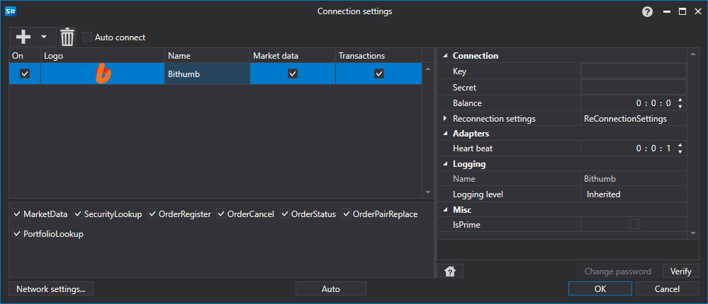

# Grafische Konfiguration Bithumb

Für alle [S#](../../../../api.md)-Produkte erfolgt die grafische Konfiguration der Verbindung im [Fenster für Verbindungseinstellungen](../../../graphical_user_interface/connection_settings_window.md):

- **Key** - Schlüssel.
- **Secret** - Geheimnis.
- **Balance** - Intervall der Guthabenprüfung. Erforderlich bei Einzahlungs- und Auszahlungsvorgängen.
- **Heart beat** - Intervall der Serverüberprüfung, um zu verfolgen, dass die Verbindung aktiv ist. Standardmäßig gleich 1 Minute.
- **Reconnection settings** - Mechanismus zur Verfolgung von Verbindungen mit den Einstellungen des Handelssystems. ([Wiederverbindungseinstellungen](../../reconnection_settings.md))
- **IsPrime** - IsPrime

## Empfohlener Inhalt

[Connectors](../../../connectors.md)

[Grafische Konfiguration](../../graphical_configuration.md)

[Erstellen eines eigenen Connectors](../../creating_own_connector.md)

[Einstellungen speichern und laden](../../save_and_load_settings.md)
