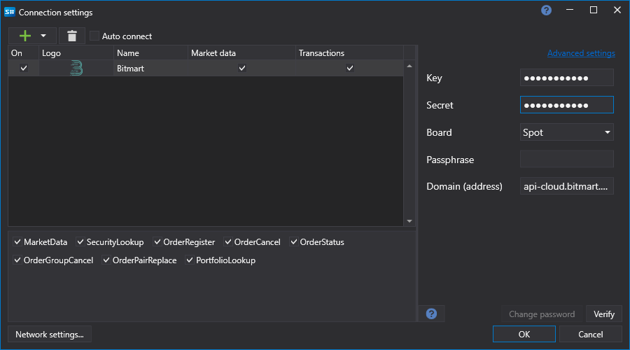

# Grafische Konfiguration Bitmart

Für alle [S#](../../../../api.md)-Produkte erfolgt die grafische Konfiguration der Verbindung im [Fenster für Verbindungseinstellungen](../../../graphical_user_interface/connection_settings_window.md):

- **Schlüssel** - Schlüssel.
- **Geheimnis** - Geheimschlüssel.
- **Bereich** - Bereich für die Verbindung (Spot, Futures).
- **Kennphrase** - Administratives Passwort.

## Empfohlener Inhalt

[Konnektoren](../../../connectors.md)

[Grafische Konfiguration](../../graphical_configuration.md)

[Erstellung eines eigenen Connectors](../../creating_own_connector.md)

[Einstellungen speichern und laden](../../save_and_load_settings.md)
