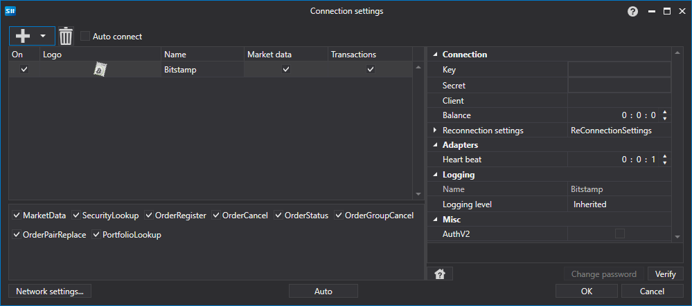

# Grafische Konfiguration BitStamp

Für alle [S#](../../../../api.md)-Produkte wird die grafische Konfiguration der Verbindung im [Fenster der Verbindungseinstellungen](../../../graphical_user_interface/connection_settings_window.md) durchgeführt:

- **Key** - Key.
- **Secret** - Secret.
- **Client** - Client-ID.
- **Balance** - Intervall der Kontostandsprüfung. Erforderlich bei Ein- und Auszahlungsvorgängen.
- **Heart beat** - Intervall der Serverprüfung, um zu verfolgen, dass die Verbindung aktiv ist. Standardmäßig gleich 1 Minute.
- **Reconnection settings** - Mechanismus zur Verfolgung von Verbindungen mit den Einstellungen des Handelssystems. ([Reconnection settings](../../reconnection_settings.md))
- **AuthV2** - AuthV2

## Empfohlener Inhalt

[Connectors](../../../connectors.md)

[Grafische Konfiguration](../../graphical_configuration.md)

[Erstellung eines eigenen Connectors](../../creating_own_connector.md)

[Einstellungen speichern und laden](../../save_and_load_settings.md)
