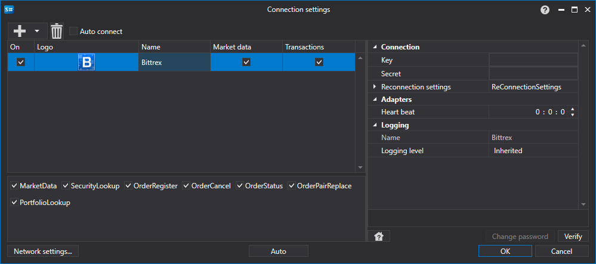

> [!CAUTION]
> **Die Börse Bittrex hat ihren Betrieb eingestellt. Der Konnektor funktioniert nicht mehr; die Dokumentation dient nur noch als Referenz.**

# Grafische Konfiguration Bittrex

Für alle [S#](../../../../api.md)-Produkte erfolgt die grafische Konfiguration der Verbindung im [Fenster für Verbindungseinstellungen](../../../graphical_user_interface/connection_settings_window.md):

- **Schlüssel** - Key.
- **Geheimnis** - Geheimer Schlüssel.
- **Verbindungsprüfung** - Intervall der Serverprüfung zur Überwachung der aktiven Verbindung. Standardmäßig gleich 1 Minute.
- **Einstellungen für die Wiederverbindung** - Mechanismus zur Überwachung der Verbindungen mit den Einstellungen des Handelssystems. ([Wiederverbindungseinstellungen](../../reconnection_settings.md))

## Empfohlener Inhalt

[Konnektoren](../../../connectors.md)

[Grafische Konfiguration](../../graphical_configuration.md)

[Erstellen eines eigenen Connectors](../../creating_own_connector.md)

[Einstellungen speichern und laden](../../save_and_load_settings.md)
