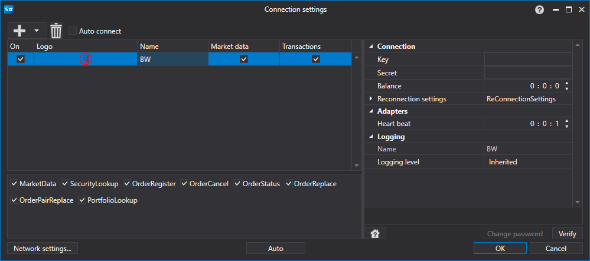

> [!WARNING]
> Diese Börse wurde dauerhaft geschlossen (~2021 — geschlossen). Dieser Connector ist nicht mehr funktionsfähig. Die Dokumentation wird zu historischen Referenzzwecken aufbewahrt.

# Grafische Konfiguration BW

Für alle [S#](../../../../api.md)-Produkte wird die grafische Konfiguration der Verbindung im [Fenster der Verbindungseinstellungen](../../../graphical_user_interface/connection_settings_window.md) durchgeführt:

- **Key** - Key.
- **Secret** - Secret.
- **Balance** - Intervall der Guthabenprüfung. Erforderlich bei Einzahlungs- und Auszahlungsaktionen.
- **Heart beat** - Intervall der Serverprüfung zur Überwachung der aktiven Verbindung. Standardmäßig gleich 1 Minute.
- **Reconnection settings** - Mechanismus zur Überwachung der Verbindungen mit den Einstellungen des Handelssystems. ([Reconnection settings](../../reconnection_settings.md))

## Empfohlener Inhalt

[Connectors](../../../connectors.md)

[Grafische Konfiguration](../../graphical_configuration.md)

[Erstellen eines eigenen Connectors](../../creating_own_connector.md)

[Speichern und Laden von Einstellungen](../../save_and_load_settings.md)
