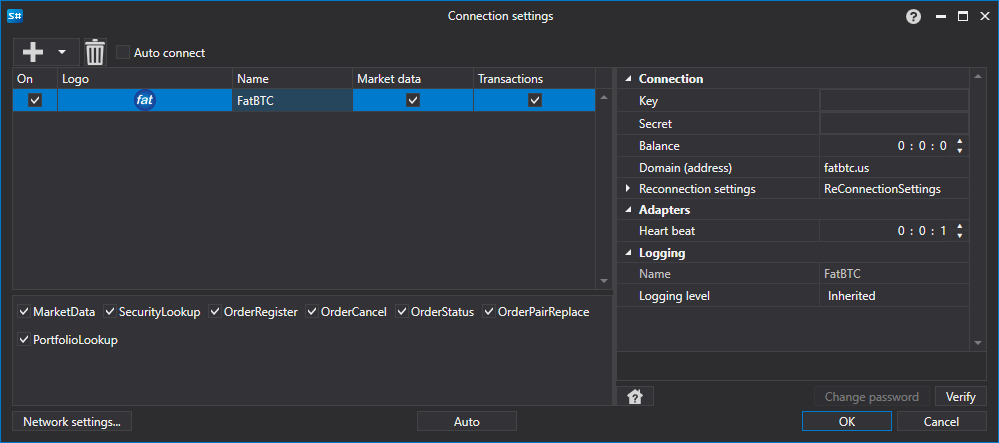

> [!WARNING]
> Diese Börse wurde dauerhaft geschlossen (~2022 - geschlossen). Dieser Connector ist nicht mehr funktionsfähig. Die Dokumentation bleibt als historische Referenz erhalten.

# Grafische Konfiguration FatBTC

Für alle [S#](../../../../api.md)-Produkte erfolgt die grafische Konfiguration der Verbindung im [Fenster für Verbindungseinstellungen](../../../graphical_user_interface/connection_settings_window.md):

- **Schlüssel** - Schlüssel.
- **Geheimnis** - Secret.
- **Balance** - Intervall für die Saldenprüfung. Erforderlich bei Ein- und Auszahlungen.
- **Domain (Adresse)** - Domainadresse.
- **Verbindungsprüfung** - Intervall für die Serverprüfung, um zu verfolgen, ob die Verbindung aktiv ist. Standardmäßig 1 Minute.
- **Einstellungen für die Wiederverbindung** - Mechanismus zur Überwachung der Verbindung mit den Einstellungen des Handelssystems. ([Einstellungen für die erneute Verbindung](../../reconnection_settings.md))

## Empfohlene Inhalte

[Konnektoren](../../../connectors.md)

[Grafische Konfiguration](../../graphical_configuration.md)

[Eigenen Connector erstellen](../../creating_own_connector.md)

[Einstellungen speichern und laden](../../save_and_load_settings.md)
