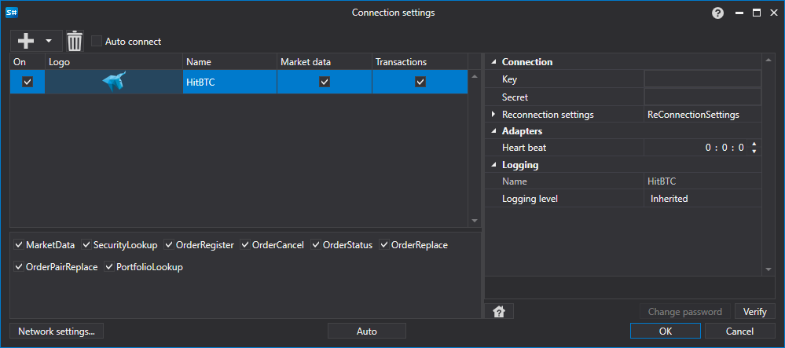

# Grafische Konfiguration HitBTC

Für alle [S#](../../../../api.md)-Produkte erfolgt die grafische Konfiguration der Verbindung im [Fenster für Verbindungseinstellungen](../../../graphical_user_interface/connection_settings_window.md):

- **Key** - Schlüssel.
- **Secret** - Secret.
- **Verbindungsprüfung** - Intervall für die Serverprüfung, um zu verfolgen, ob die Verbindung aktiv ist. Standardmäßig 1 Minute.
- **Einstellungen für die Wiederverbindung** - Mechanismus zur Überwachung der Verbindung mit den Einstellungen des Handelssystems. ([Einstellungen für die erneute Verbindung](../../reconnection_settings.md))

## Empfohlene Inhalte

[Konnektoren](../../../connectors.md)

[Grafische Konfiguration](../../graphical_configuration.md)

[Eigenen Connector erstellen](../../creating_own_connector.md)

[Einstellungen speichern und laden](../../save_and_load_settings.md)
