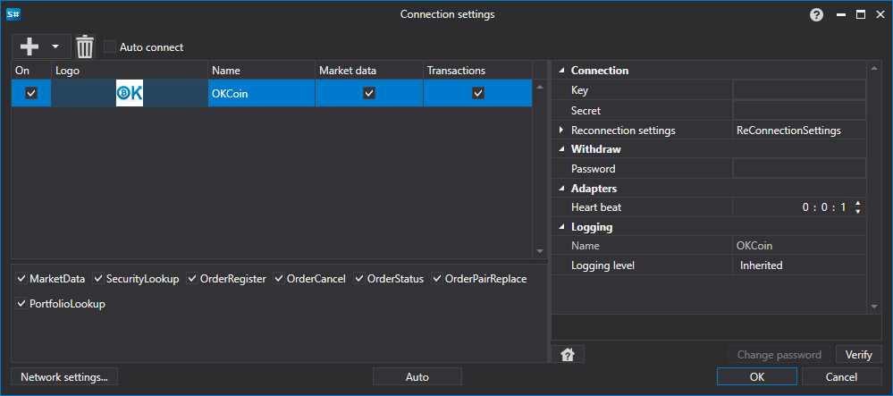

# Grafische Konfiguration von OKCoin

Für alle [S#](../../../../api.md)-Produkte erfolgt die grafische Konfiguration der Verbindung im [Fenster für Verbindungseinstellungen](../../../graphical_user_interface/connection_settings_window.md):

- **Key** - Schlüssel.
- **Secret** - Geheimer Schlüssel.
- **Password** - Administratorpasswort.
- **Heart beat** - Intervall zur Serverprüfung, um zu überwachen, ob die Verbindung aktiv ist. Standardmäßig 1 Minute.
- **Reconnection settings** - Einstellungen des Mechanismus zur Verbindungsüberwachung mit dem Handelssystem. ([Einstellungen für die Wiederverbindung](../../reconnection_settings.md))

## Empfohlene Inhalte

[Connectoren](../../../connectors.md)

[Grafische Konfiguration](../../graphical_configuration.md)

[Eigenen Connector erstellen](../../creating_own_connector.md)

[Einstellungen speichern und laden](../../save_and_load_settings.md)

