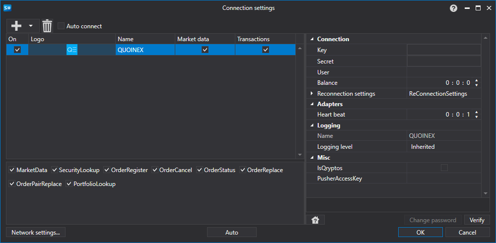

> [!CAUTION]
> **Die Börse QUOINEX wurde in Liquid umbenannt, die später ihren Betrieb einstellte. Der Konnektor funktioniert nicht mehr; die Dokumentation dient nur noch als Referenz.**

# Grafische Konfiguration von Quoinex

Für alle [S#](../../../../api.md)-Produkte erfolgt die grafische Konfiguration der Verbindung im [Fenster für Verbindungseinstellungen](../../../graphical_user_interface/connection_settings_window.md):

- **Schlüssel** - Schlüssel.
- **Geheimnis** - Geheimer Schlüssel.
- **Benutzer** - Benutzer
- **Saldo** - Intervall zur Kontostandsprüfung. Erforderlich bei Einzahlungen und Auszahlungen.
- **Verbindungsprüfung** - Intervall zur Serverprüfung, um zu überwachen, ob die Verbindung aktiv ist. Standardmäßig 1 Minute.
- **Einstellungen für die Wiederverbindung** - Einstellungen des Mechanismus zur Verbindungsüberwachung mit dem Handelssystem. ([Einstellungen für die Wiederverbindung](../../reconnection_settings.md))
- **IsQryptos** - IsQryptos
- **PusherAccessKey** - PusherAccessKey

## Empfohlene Inhalte

[Connectoren](../../../connectors.md)

[Grafische Konfiguration](../../graphical_configuration.md)

[Eigenen Connector erstellen](../../creating_own_connector.md)

[Einstellungen speichern und laden](../../save_and_load_settings.md)

