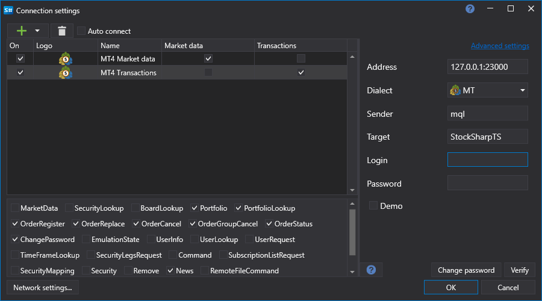

# MetaTrader

[StockSharp](../../../api.md) integriert sich über spezielle Connectoren in MT4- und MT5-Terminals. Verwenden Sie zur Installation dieser Connectoren den [Installer](../../../installer.md). Weitere Informationen finden Sie unter [Programme installieren und entfernen](../../../installer/install_and_remove_apps.md).

Beide Connectoren werden auf die gleiche Weise verwendet. Daher wird im Folgenden der Verbindungsprozess für MT5 beschrieben:

## MT-Connector einrichten

> [!Video https://www.youtube.com/embed/qGnIa7YIS5Q]

1. Wählen Sie den MT-Connector im [Installer](../../../installer.md) aus und starten Sie den Installationsprozess.

   

2. Der [Installer](../../../installer.md) fragt, in welchem Ordner der Connector installiert werden soll. Er muss im Ordner Experts installiert werden.

   

3. Wenn mehrere Terminals installiert sind, müssen Sie das Terminal auswählen, in dem der Connector installiert werden soll.

   

4. Nach Auswahl des gewünschten Terminals wird der Pfad zum Ordner Experts angezeigt.

   

   > [!TIP]
   > - Wenn der Pfad nicht automatisch ermittelt werden kann, müssen Sie ihn manuell über die Ordnersuche auswählen: *C:\\Users\\%ihr_benutzername%\\AppData\\Roaming\\MetaQuotes\\Terminal\\%viele_buchstaben_und_zahlen%\\MQL4\\Experts\\* (für MT5 enthält der Pfad MQL5).

5. Schließen Sie die Installation ab und warten Sie, bis sie beendet ist. Am Ende der Installation weist der [Installer](../../../installer.md) darauf hin, dass das Terminal nun konfiguriert werden muss. Starten Sie dazu das MT-Terminal und stellen Sie eine Verbindung zum Handel her.
6. Wählen Sie im Menü Extras -> Optionen die Registerkarte **Experten** aus und stellen Sie sicher, dass die Berechtigung für externen DLL-Handel (**DLL-Importe zulassen**) aktiviert ist:
7. Wenn das Terminal während der Connector-Installation bereits ausgeführt wurde (Schritt 2), müssen Sie die Liste der Experten aktualisieren: Klicken Sie mit der rechten Maustaste auf Experten und wählen Sie im Menü **Aktualisieren**:

   

8. Wählen Sie den S#-Experten aus, klicken Sie mit der rechten Maustaste darauf und wählen Sie im Menü **An Chart anhängen**:

   

9. Es wird ein Einstellungsfenster angezeigt, in dem Sie Login und Passwort festlegen können. Die anonyme Autorisierung ist standardmäßig aktiviert. Außerdem können Sie die Verbindungsadresse angeben. Wenn mehrere Terminals gleichzeitig verbunden werden, müssen die Adressen eindeutige Ports enthalten.
10. In der rechten oberen Ecke des Charts sollte ein Smiley-Symbol erscheinen (das erste gefundene):

    

    Außerdem sollten im Logfenster des Experten Informationen über den erfolgreichen Start des Skripts und die Anzahl der Instrumente erscheinen.
11. Wenn die MT4- oder MT5-Lizenz nicht vorhanden ist, erscheint im Log eine Zeile ähnlich der folgenden:

    

12. Die Verbindung zu MT erfolgt über das FIX-Protokoll mit dem Connector [FIX-Protokoll](../common/fix_protocol.md). Zur Demonstration wurde das Programm [Terminal](../../../terminal.md) verwendet. Unten sehen Sie die Einstellungen für die Transaktionsverbindung und die Marktdatenverbindung. Für MT5 ist der Standardport 23001 statt 23000:

    

    Ähnliche Einstellungen müssen in [Designer](../../../designer.md), [Hydra](../../../hydra.md) oder beliebigen API-Programmen vorgenommen werden.

    Login und Passwort bleiben bei anonymer Autorisierung leer (vorheriger Punkt). Wenn mehrere Roboter mit MT verbunden werden, muss zur Unterscheidung der Verbindungen ein eindeutiger Login angegeben werden.

    > [!TIP]
    > - Das Skript muss vor der Verbindung von StockSharp mit MetaTrader gestartet werden und so länge ausgeführt bleiben, wie diese Verbindung benötigt wird.
    > - Um historische Kerzen in StockSharp zu sehen, müssen sie vom MetaTrader-Server heruntergeladen werden. Wie das funktioniert, lesen Sie in der MetaTrader-Dokumentation.

    Bei erfolgreicher Verbindung sollte das Beispiel eine Liste der Instrumente und Konten anzeigen:

    

13. Bei Fehlern werden die Connector-Logs im Ordner **Experts\\StockSharp\\Data\\Log** gespeichert:

    
