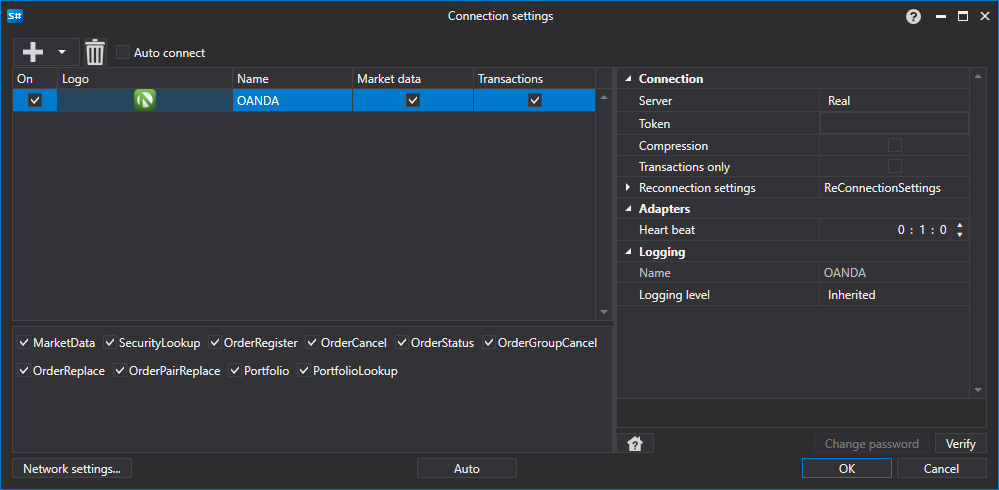

# Grafische Konfiguration von Oanda

Für alle [S#](../../../../api.md)-Produkte erfolgt die grafische Konfiguration der Verbindung im [Fenster für Verbindungseinstellungen](../../../graphical_user_interface/connection_settings_window.md):

- **Server** - Server.
- **Token** - Token.
- **Compression** - Komprimierung.
- **Transactions only** - Logmeldungen nur für den Transaktionsstream schreiben.
- **Einstellungen für die Wiederverbindung** - Einstellungen des Mechanismus zur Überwachung der Verbindung mit dem Handelssystem ([Einstellungen für die Wiederverbindung](../../reconnection_settings.md)).
- **Intervall der Verbindungsprüfung** - Intervall für die Benachrichtigung des Servers, dass die Verbindung weiterhin aktiv ist. Standardwert: 1 Minute.
- **Vereinheitlichter Board-Code** - Board-Code für das vereinheitlichte Instrument.

## Siehe auch

[Connectoren](../../../connectors.md)

[Grafische Konfiguration](../../graphical_configuration.md)

[Eigenen Connector erstellen](../../creating_own_connector.md)

[Einstellungen speichern und laden](../../save_and_load_settings.md)
