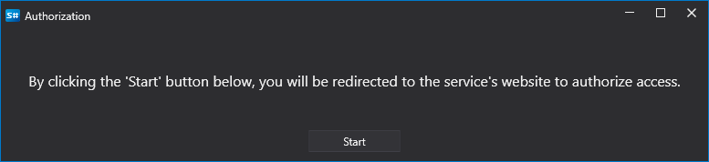

# OAuth-Autorisierung

Um OAuth-Autorisierung in Connectoren in Ihrem Programm zu verwenden, müssen Sie mehrere Dienste registrieren:

```csharp
// Passwortspeicher für den Zugriff auf StockSharp WebAPI verbinden.
ConfigManager.RegisterService<ICredentialsProvider>(new DefaultCredentialsProvider());
//ConfigManager.RegisterService<ICredentialsProvider>(new TokenCredentialsProvider("%token%"));

// Dienstanbieter für den Zugriff auf StockSharp WebAPI verbinden.
ConfigManager.RegisterService<IApiServiceProvider>(new ApiServiceProvider());

// OAuth-Autorisierungsdienst, der von Connectoren verwendet wird.
ConfigManager.RegisterService<IOAuthProvider>(new OAuthProvider());
//ConfigManager.RegisterService<IOAuthProvider>(new WebApiOAuthProvider());
```

- [DefaultCredentialsProvider](xref:StockSharp.Configuration.DefaultCredentialsProvider) und [TokenCredentialsProvider](xref:StockSharp.Configuration.TokenCredentialsProvider) implementieren die Schnittstelle [ICredentialsProvider](xref:StockSharp.Configuration.ICredentialsProvider).
- [ApiServiceProvider](xref:StockSharp.Web.Api.Client.ApiServiceProvider) implementiert die Schnittstelle [IApiServiceProvider](xref:StockSharp.Web.Api.Client.IApiServiceProvider).
- `OAuthProvider` implementiert die Schnittstelle [IOAuthProvider](xref:Ecng.Net.IOAuthProvider).

Für [ICredentialsProvider](xref:StockSharp.Configuration.ICredentialsProvider) gibt es zwei Implementierungsoptionen:

1. [DefaultCredentialsProvider](xref:StockSharp.Configuration.DefaultCredentialsProvider) - lädt StockSharp-Kontodaten aus einer lokalen Datei. Eine vorherige Autorisierung ist erforderlich, beispielsweise über den Installer.

2. [TokenCredentialsProvider](xref:StockSharp.Configuration.TokenCredentialsProvider) - übergibt den Token direkt aus dem Code. Auf dem Rechner ist keine geheime Datei erforderlich. Den Token erhalten Sie unter [https://stocksharp.com/de/profile/](https://stocksharp.com/de/profile/):

   

Für [IOAuthProvider](xref:Ecng.Net.IOAuthProvider) gibt es zwei Implementierungsoptionen:

1. [WebApiOAuthProvider](xref:StockSharp.Studio.WebApi.WebApiOAuthProvider) - für Konsolenanwendungen, in denen kein Autorisierungsfenster angezeigt werden muss.

2. [OAuthProvider](xref:StockSharp.Studio.Controls.OAuthProvider) - für WPF-Anwendungen, in denen ein Autorisierungsfenster angezeigt werden muss:

   
