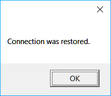

# Einstellungen für die Wiederverbindung

Alle Connectoren bieten die Möglichkeit, eine Wiederverbindung für den Fall eines Verbindungsabbruchs zu konfigurieren. Im grafischen Element [Fenster für Verbindungseinstellungen](../graphical_user_interface/connection_settings_window.md) sieht dies so aus:


**Eigenschaften der Wiederverbindung**

- **Interval** - Das Intervall, in dem Verbindungsversuche ausgeführt werden.
- **Initially** - Die Anzahl der Versuche, die erste Verbindung herzustellen, wenn sie nicht hergestellt wurde (Timeout, Netzwerkfehler usw.).
- **Reconnection** - Die Anzahl der Versuche, die Verbindung erneut herzustellen, wenn sie während des Betriebs getrennt wurde.
- **Timeout** - Timeout für eine erfolgreiche Verbindung/Trennung.
- **Operating mode** - Der Betriebsmodus, während dessen Verbindungsversuche ausgeführt werden sollen.

## Wiederverbindung im Code konfigurieren

Der Wiederverbindungsmechanismus wird über die Eigenschaft [ReConnectionSettings](xref:StockSharp.Messages.IMessageAdapter.ReConnectionSettings) konfiguriert und ermöglicht die Überwachung der folgenden Fehlerszenarien:

- Eine Verbindung kann nicht hergestellt werden (keine Kommunikation, falscher Benutzername/falsches Passwort usw.). Die Eigenschaft [ReConnectionSettings.AttemptCount](xref:StockSharp.Messages.ReConnectionSettings.AttemptCount) legt die Anzahl der Versuche zum Herstellen einer Verbindung fest. Standardmäßig ist sie 0, was bedeutet, dass der Modus deaktiviert ist. -1 bedeutet eine unbegrenzte Anzahl von Versuchen.
- Die Verbindung wurde während des Betriebs unterbrochen. Die Eigenschaft [ReConnectionSettings.ReAttemptCount](xref:StockSharp.Messages.ReConnectionSettings.ReAttemptCount) legt die Anzahl der Versuche fest, die Verbindung erneut herzustellen. Standardmäßig ist sie 100. -1 bedeutet eine unbegrenzte Anzahl von Versuchen. 0 - der Modus ist deaktiviert.
- Beim Verbinden oder Trennen einer Verbindung werden die entsprechenden Ereignisse [IConnector.Connected](xref:StockSharp.BusinessEntities.IConnector.Connected) oder [IConnector.Disconnected](xref:StockSharp.BusinessEntities.IConnector.Disconnected) möglicherweise länge Zeit nicht empfangen. Für solche Situationen können Sie die Eigenschaft [ReConnectionSettings.TimeOutInterval](xref:StockSharp.Messages.ReConnectionSettings.TimeOutInterval) verwenden, um den maximal zulässigen Timeout für ein erfolgreiches Ereignis festzulegen. Wenn das gewünschte Ereignis nach dieser Zeit nicht eintritt, wird das Ereignis [IConnector.ConnectionError](xref:StockSharp.BusinessEntities.IConnector.ConnectionError) mit einem Timeout-Fehler ausgelöst.

1. Beim Erstellen eines Gateways müssen Sie die Einstellungen des Wiederverbindungsmechanismus über die Eigenschaft [ReConnectionSettings](xref:StockSharp.Messages.IMessageAdapter.ReConnectionSettings) initialisieren:

   ```cs
   // Wiederverbindungsmechanismus initialisieren (er stellt automatisch
   // alle 10 Sekunden eine Verbindung her, wenn das Gateway die Verbindung zum Server verliert)
   Connector.Adapter.ReConnectionSettings.Interval = TimeSpan.FromSeconds(10);
   // Wiederverbindung funktioniert nur während der Arbeitszeiten des ausgewählten Boards
   // (um die Wiederverbindung zu deaktivieren, wenn normalerweise kein Handel stattfindet, z. B. nachts)
   Connector.Adapter.ReConnectionSettings.WorkingTime = ExchangeBoard.Nasdaq.WorkingTime;
   ```
2. Um zu prüfen, wie der Mechanismus zur Verbindungskontrolle funktioniert, können Sie die Internetverbindung ausschalten:

   
3. Unten sehen Sie das Programmlog. Es zeigt, dass die Anwendung zunächst verbunden ist und nach dem Ausschalten der Internetverbindung versucht, die Verbindung erneut herzustellen. Nach der Wiederherstellung der Internetverbindung wird die Anwendungsverbindung wiederhergestellt:

   
4. Da in [Connector](xref:StockSharp.Algo.Connector) mehrere Verbindungen verwendet werden können, werden Ereignisse im Zusammenhang mit der Wiederverbindung, beispielsweise [ConnectionRestored](xref:StockSharp.Algo.Connector.ConnectionRestored), standardmäßig nicht ausgelöst, und die Verbindungsadapter versuchen selbst, die Verbindung erneut herzustellen. Damit das Ereignis ausgelöst wird, müssen Sie den Wert der Eigenschaft [BasketMessageAdapter.SuppressReconnectingErrors](xref:StockSharp.Algo.BasketMessageAdapter.SuppressReconnectingErrors) des Adapters auf **false** setzen.

   ```cs
   Connector.Adapter.SuppressReconnectingErrors = false;
   Connector.ConnectionError += error => this.Sync(() => MessageBox.Show(this, "Verbindung verloren"));
   Connector.ConnectionRestored += adapter => this.Sync(() => MessageBox.Show(this, "Verbindung wiederhergestellt"));
   ```

   
