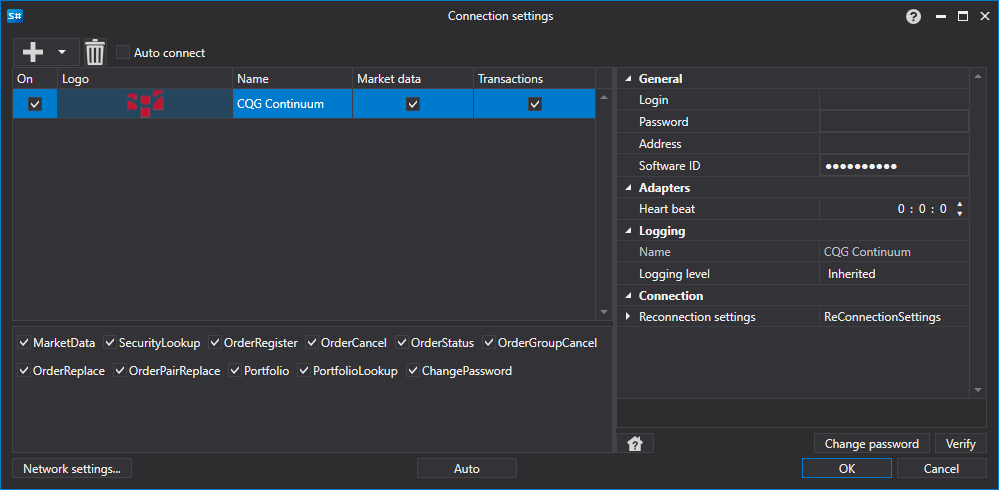

# Grafische Konfiguration CQG Continuum

Für alle [S#](../../../../api.md)-Produkte wird die grafische Konfiguration der Verbindung im [Fenster Verbindungseinstellungen](../../../graphical_user_interface/connection_settings_window.md) vorgenommen:

- **Login** - Login.
- **Password** - Password.
- **Address** - Serveradresse.
- **Software ID** - Eindeutige Software-ID.
- **Heart beat** - Intervall zur Serverpruefung, um zu verfolgen, ob die Verbindung aktiv ist. Standardmaessig 1 Minute.
- **Reconnection settings** - Mechanismus für Einstellungen zur Überwachung von Verbindungen mit dem Handelssystem. ([Einstellungen für die Wiederverbindung](../../reconnection_settings.md))

## Empfohlene Inhalte

[Connectors](../../../connectors.md)

[Grafische Konfiguration](../../graphical_configuration.md)

[Eigenen Connector erstellen](../../creating_own_connector.md)

[Einstellungen speichern und laden](../../save_and_load_settings.md)
