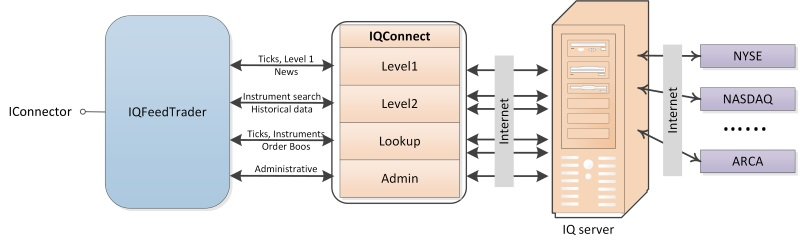

# IQFeed

**DTN IQFeed** - Anbieter von Echtzeit-Marktdaten für Aktienkurse, Forex, Nachrichten, Futures-Kontrakte usw.

Bevor Sie Handelsroboter für die aktuelle Handelsplattform schreiben, wird empfohlen, die Links unter [Konnektoren](../../connectors.md) zu lesen.

## Konfiguration IQFeed

Der Interaktionsmechanismus ist in dieser Abbildung dargestellt:

Um mit dem **IQFeed**-Connector zu arbeiten, müssen Sie den Router **IQ Feed Client** auf dem Computer installieren; er kann sowohl auf dem lokalen als auch auf einem entfernten Computer installiert werden. Der Datenaustausch zwischen der Clientanwendung und dem **IQ Feed Client** sowie zwischen dem **IQ Feed Client** und den Servern erfolgt über das TCP/IP-Protokoll.

Um den **IQ Feed Client** von der [IQFeed](https://www.iqfeed.net/stocksharp/)-Website herunterzuladen, müssen Sie sich zuerst mit dem von **iQFeed** erhaltenen Passwort und Login autorisieren.

Nach der Installation von **IQ Feed Client** wird empfohlen, den Computer neu zu starten.

Nach der Installation von **IQ Feed Client, IQLink Launcher** muss dieser gestartet werden.

Klicken Sie im geöffneten Fenster **IQLink Launcher** auf **Start IQLink**.

Geben Sie im geöffneten Fenster **IQ Connect Login** den **Benutzernamen** und das **Passwort** (oder die PIN) ein, die Sie vom Dienst **iQFeed** erhalten haben. Diese Zugangsdaten sind nicht mit dem Benutzernamen und Passwort der **iQFeed**-Website identisch. Klicken Sie nach der Eingabe der Zugangsdaten auf **Connect**.

Zum Empfangen von Daten verwendet die Clientanwendung vier Verbindungen über verschiedene Ports:

1. Level1 (Port 5009) wird verwendet, um Echtzeitdaten zu Instrumenten (Ticks, Eröffnungs- und Schlusskurse, Volatilität usw.) und Nachrichten zu erhalten.
2. Level2 (Port 9200) wird verwendet, um erweiterte Quotes für Instrumente zu erhalten; für jedes ECN können Sie das beste Quote-Paar erhalten.
3. Lookup (Port 9100) wird verwendet, um nach Instrumenten zu suchen, historische Daten abzurufen und erweiterte Informationen zu Nachrichten zu erhalten.
4. Admin (Port 9300) wird verwendet, um allgemeine Informationen zur Verbindung zu erhalten und Einstellungen zu ändern.

Die Portnummern, die standardmäßig für die Verbindung mit dem **IQ Feed Client** verwendet werden, sind in Klammern angegeben. Für Clientverbindungen können die Portnummern in der Registry geändert werden, zum Beispiel für Level1 unter folgendem Pfad: \[HKEY\_CURRENT\_USER\\SOFTWARE\\DTN\\IQFEED\\Startup\\Level1Port\]. Portnummern für die Verbindung zu IQ-Servern können nicht geändert werden.

> [!CAUTION]
> Der Connector unterstützt nur den Marktdaten-Feed; Transaktionen werden nicht unterstützt.

## Empfohlene Inhalte

[Konnektoren](../../connectors.md)

[Grafische Konfiguration](../graphical_configuration.md)

[Einstellungen speichern und laden](../save_and_load_settings.md)

[Eigenen Connector erstellen](../creating_own_connector.md)

[Auftragsverwaltung](../../orders_management.md)

[Neuen Auftrag erstellen](../../orders_management/create_new_order.md)

[Neue Stop-Order erstellen](../../orders_management/create_new_stop_order.md)

[Verbindung IQFeed](iqfeed/connection_iqfeed.md)

[Adapterinitialisierung IQFeed](iqfeed/adapter_initialization_iqfeed.md)
