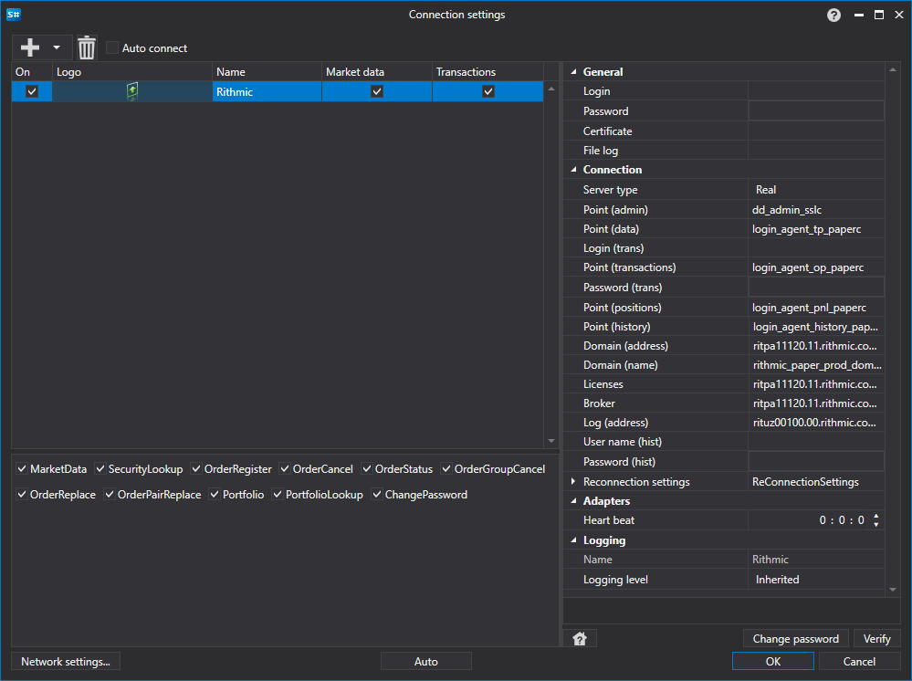

# Grafische Konfiguration Rithmic

Für alle [S#](../../../../api.md)-Produkte erfolgt die grafische Konfiguration der Verbindung im [Fenster für Verbindungseinstellungen](../../../graphical_user_interface/connection_settings_window.md):

- **Benutzername** - Benutzername.
- **Passwort** - Passwort.
- **Zertifikat** - Pfad zur Zertifikatsdatei, erforderlich für die Verbindung zum Rithmic-System.
- **Protokolldatei** - Pfad zur Logdatei.
- **Servertyp** - Servertyp.
- **Punkt (Administration)** - Verbindungspunkt für administrative Funktionen (Initialisierung/Deinitialisierung).
- **Punkt (Daten)** - Verbindungspunkt für Marktdaten.
- **Benutzername (Transaktionen)** - Zusätzlicher Benutzername. Wird verwendet, wenn Transaktionen an einen separaten Server gesendet werden.
- **Punkt (Transaktionen)** - Verbindungspunkt zum System für die Transaktionsausführung.
- **Passwort (Transaktionen)** - Zusätzliches Passwort. Wird verwendet, wenn Transaktionen an einen separaten Server gesendet werden.
- **Punkt (Positionen)** - Verbindungspunkt für den Zugriff auf Portfolio- und Positionsinformationen.
- **Punkt (Historie)** - Verbindungspunkt für den Zugriff auf historische Daten.
- **Domain (Adresse)** - Domainadresse.
- **Domain (Name)** - Domainname.
- **Lizenzen** - Adresse des Lizenzservers.
- **Brokeradresse** - Brokeradresse.
- **Log (Adresse)** - Adresse des Protokollierers.
- **Benutzername (hist)** - Zusätzlicher Benutzername. Benutzer-ID für die Authentifizierung beim Historienservice.
- **Passwort (Historie)** - Zusätzliches Passwort. Passwort für die Authentifizierung beim Historienservice.
- **Verbindungsprüfung** - Intervall zur Serverprüfung, um die Verbindung zu überwachen. Standardmäßig 1 Minute.
- **Einstellungen für die Wiederverbindung** - Mechanismus zur Überwachung von Verbindungen mit den Einstellungen des Handelssystems. ([Einstellungen für die Wiederverbindung](../../reconnection_settings.md))

## Empfohlene Inhalte

[Connectoren](../../../connectors.md)

[Grafische Konfiguration](../../graphical_configuration.md)

[Eigenen Connector erstellen](../../creating_own_connector.md)

[Einstellungen speichern und laden](../../save_and_load_settings.md)
