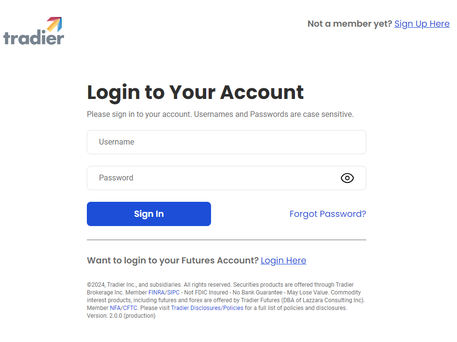

# Grafische Konfiguration von Tradier

Für alle StockSharp-Produkte erfolgt die grafische Verbindungseinrichtung im [Fenster für Verbindungseinstellungen](../../../graphical_user_interface/connection_settings_window.md):

- **Token** - Autorisierungstoken.
- **Demomodus** - Demomodus.

OAuth-Autorisierung:

1. Sie können das Token direkt in das Feld "Token" einfügen.
2. Wenn Sie das Token-Feld leer lassen und der Modus "Demo" nicht ausgewählt ist, wird die OAuth-Autorisierung verwendet.

OAuth-Autorisierungsprozess:

1. Wenn Sie auf die Schaltfläche "Check" klicken, wird ein Fenster geöffnet:

   

2. Nach dem Klick auf "Start" wird der Benutzer zur Tradier-Website weitergeleitet, um sich anzumelden:

   

3. Auf der Tradier-Website müssen Sie der StockSharp-Anwendung Zugriff auf Handelsoperationen erlauben:

   

4. Anschließend werden Sie zurück zur StockSharp-Website geleitet, und das Programm meldet sich automatisch an.

## Siehe auch

[Connectoren](../../../connectors.md)

[OAuth](../../oauth.md)

[Grafische Konfiguration](../../graphical_configuration.md)

[Eigenen Connector erstellen](../../creating_own_connector.md)

[Einstellungen speichern und laden](../../save_and_load_settings.md)
