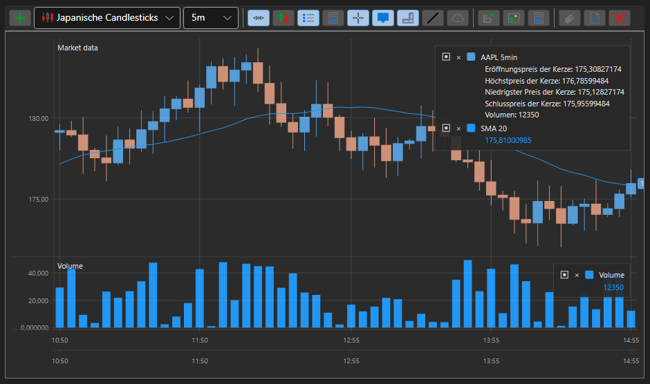

# Diagramme

[S#](../../api.md) stellt praktische Komponenten zum Erstellen von Diagrammen bereit. Diese Komponenten sind im Namespace [StockSharp.Xaml.Charting](xref:StockSharp.Xaml.Charting) zusammengefasst.

Das zentrale Konzept der Grafikbibliothek ist das *Diagramm*. Ein *Diagramm* ist ein Container für andere Elemente, die beim Aufbau von Diagrammen verwendet werden. In [S#](../../api.md) gibt es mehrere Typen von *Diagrammen*:

- [Chart](xref:StockSharp.Xaml.Charting.Chart) - grafische Komponente zur Anzeige von Börsendiagrammen.
- [ChartPanel](xref:StockSharp.Xaml.Charting.ChartPanel) - erweiterte grafische Komponente zur Anzeige von Börsendiagrammen.
- [EquityCurveChart](xref:StockSharp.Xaml.Charting.EquityCurveChart) - grafische Komponente zur Anzeige von Equity-Kurven.
- [BoxChart](charts/box_chart.md) - Diagramm, das Volumina als Zahlengitter darstellt.
- [ClusterChart](charts/cluster_chart.md) - Diagramm, das Volumina als Cluster mit Histogrammen anzeigt.
- [OptionPositionChart](xref:StockSharp.Xaml.Charting.OptionPositionChart) - grafische Komponente, die Optionspositionen und Optionsgriechen relativ zum Basiswert anzeigt. Siehe [OptionPositionChart](options/position_chart.md).

Zusätzlich enthält [S#](../../api.md) zwei Diagrammtypen für die Volumenanalyse: [BoxChart](charts/box_chart.md) und [ClusterChart](charts/cluster_chart.md).

Die folgende Abbildung zeigt die Hauptelemente der grafischen Komponente.

## Elemente der grafischen Komponente

## IChart

[IChart](xref:StockSharp.Charting.IChart) ist die Basisschnittstelle für alle Diagrammtypen. Sie enthält Methoden zum Hinzufügen und Entfernen von "Kind"-Elementen, Eigenschaften zur Anpassung von Darstellung und Zeichenmethoden der Komponente sowie eine Methode zum Zeichnen der Diagramme selbst. Ein *Diagramm* kann mehrere Bereiche ([IChartArea](xref:StockSharp.Charting.IChartArea)) zum Zeichnen enthalten (siehe Abbildung). [Chart](xref:StockSharp.Xaml.Charting.Chart) enthält außerdem einen *OverView*-Vorschaubereich (siehe Abbildung). In diesem Bereich können Sie den sichtbaren Diagrammbereich mithilfe von Schiebereglern auswählen. Zusätzlich können Sie das Diagramm durch Ziehen von [IChartArea](xref:StockSharp.Charting.IChartArea), X-Achse und Mausrad scrollen und zoomen.

**Wichtige Eigenschaften und Methoden von [IChart](xref:StockSharp.Charting.IChart)**

- [IChart.Areas](xref:StockSharp.Charting.IChart.Areas) - Liste der [IChartArea](xref:StockSharp.Charting.IChartArea)-Bereiche.
- [IThemeableChart.ChartTheme](xref:StockSharp.Charting.IThemeableChart.ChartTheme) - Theme der Komponente.
- [IChart.IndicatorTypes](xref:StockSharp.Charting.IChart.IndicatorTypes) - Liste der Indikatoren, die im Diagramm angezeigt werden können.
- [IChart.CrossHair](xref:StockSharp.Charting.IChart.CrossHair) - Anzeige des Fadenkreuzes aktivieren/deaktivieren.
- [IChart.CrossHairAxisLabels](xref:StockSharp.Charting.IChart.CrossHairAxisLabels) - Anzeige von Achsenbeschriftungen am Fadenkreuz aktivieren/deaktivieren.
- [IChart.IsAutoRange](xref:StockSharp.Charting.IChart.IsAutoRange) - automatische Skalierung der X-Achse aktivieren/deaktivieren.
- [IChart.IsAutoScroll](xref:StockSharp.Charting.IChart.IsAutoScroll) - automatisches Scrollen auf der X-Achse aktivieren/deaktivieren.
- [IChart.ShowLegend](xref:StockSharp.Charting.IChart.ShowLegend) - Anzeige der Legende aktivieren/deaktivieren.
- [IChart.ShowOverview](xref:StockSharp.Charting.IChart.ShowOverview) - Anzeige des *OverView*-Vorschaubereichs aktivieren/deaktivieren.
- [IChart.AddArea](xref:StockSharp.Charting.IChart.AddArea(StockSharp.Charting.IChartArea)) - einen [IChartArea](xref:StockSharp.Charting.IChartArea) hinzufügen.
- [IChart.AddElement](xref:StockSharp.Charting.IChart.AddElement(StockSharp.Charting.IChartArea, StockSharp.Charting.IChartElement)) - ein Datenreihenelement hinzufügen. Verfügt über mehrere Überladungen.
- [IChart.Reset](xref:StockSharp.Charting.IChart.Reset(System.Collections.Generic.IEnumerable{StockSharp.Charting.IChartElement})) - zuvor gezeichnete Werte "zurücksetzen".
- [IChart.Draw](xref:StockSharp.Charting.IThemeableChart.Draw(StockSharp.Charting.IChartDrawData)) - einen Wert im Diagramm zeichnen.
- [IChart.OrderCreationMode](xref:StockSharp.Charting.IChart.OrderCreationMode) - Modus zur Auftragserstellung; wenn gesetzt, können Aufträge aus dem Diagramm erstellt werden. Standardmäßig deaktiviert.

## IChartArea

[IChartArea](xref:StockSharp.Charting.IChartArea) - ein Bereich zum Zeichnen im Diagramm; dient als Container für [IChartElement](xref:StockSharp.Charting.IChartElement) (Indikatoren, Kerzen usw.), die im Diagramm gerendert werden, sowie für Diagrammachsen ([IChartAxis](xref:StockSharp.Charting.IChartAxis)).

**Wichtige Eigenschaften von [IChartArea](xref:StockSharp.Charting.IChartArea)**

- [IChartArea.Elements](xref:StockSharp.Charting.IChartArea.Elements) - Liste von [IChartElement](xref:StockSharp.Charting.IChartElement).
- [IChartArea.XAxises](xref:StockSharp.Charting.IChartArea.XAxises) - Liste der horizontalen Achsen.
- [IChartArea.YAxises](xref:StockSharp.Charting.IChartArea.YAxises) - Liste der vertikalen Achsen.

## IChartElement

Alle im Diagramm angezeigten Elemente müssen die Schnittstelle [IChartElement](xref:StockSharp.Charting.IChartElement) implementieren. In [S#](../../api.md) implementieren die folgenden Klassen diese Schnittstelle:

- [ChartCandleElement](xref:StockSharp.Xaml.Charting.ChartCandleElement) - Element zur Anzeige von Kerzen.
- [ChartIndicatorElement](xref:StockSharp.Xaml.Charting.ChartIndicatorElement) - Element zur Anzeige von Indikatoren.
- [ChartOrderElement](xref:StockSharp.Xaml.Charting.ChartOrderElement) - Element zur Anzeige von Aufträgen.
- [ChartTradeElement](xref:StockSharp.Xaml.Charting.ChartTradeElement) - Element zur Anzeige von Trades.

Die Klassen visueller Elemente besitzen mehrere Eigenschaften zur Anpassung des Erscheinungsbilds des Diagramms. Sie können Farben, Linienstärke und Stil von Elementen anpassen. Mit der Eigenschaft [IChartCandleElement.DrawStyle](xref:StockSharp.Charting.IChartCandleElement.DrawStyle) können Sie beispielsweise das Aussehen der Kerze ändern (Kerze oder Balken). Mit der Eigenschaft [ChartIndicatorElement.DrawStyle](xref:StockSharp.Xaml.Charting.ChartIndicatorElement.DrawStyle) können Sie den Stil der Indikatorlinie festlegen. Um den Indikator als Histogramm anzuzeigen, verwenden Sie den Wert [DrawStyles.Histogram](xref:Ecng.Drawing.DrawStyles.Histogram). Die Eigenschaften [ChartCandleElement.ShowAxisMarker](xref:StockSharp.Xaml.Charting.ChartCandleElement.ShowAxisMarker) und [ChartIndicatorElement.ShowAxisMarker](xref:StockSharp.Xaml.Charting.ChartIndicatorElement.ShowAxisMarker) ermöglichen das Ein- und Ausschalten der Markeranzeige (siehe Abbildung) auf den Achsen des Diagramms.

## Siehe auch

- [JavaScript-Diagramme](../javascript_ui/charts.md)
- [Kerzendiagramm](charts/candle_chart.md)
- [Diagramm-Panel](charts/candle_chart_panel.md)
- [Equity-Curve-Diagramm](charts/equity_curve_chart.md)
- [Box-Charts](charts/box_chart.md)
- [Cluster](charts/cluster_chart.md)
