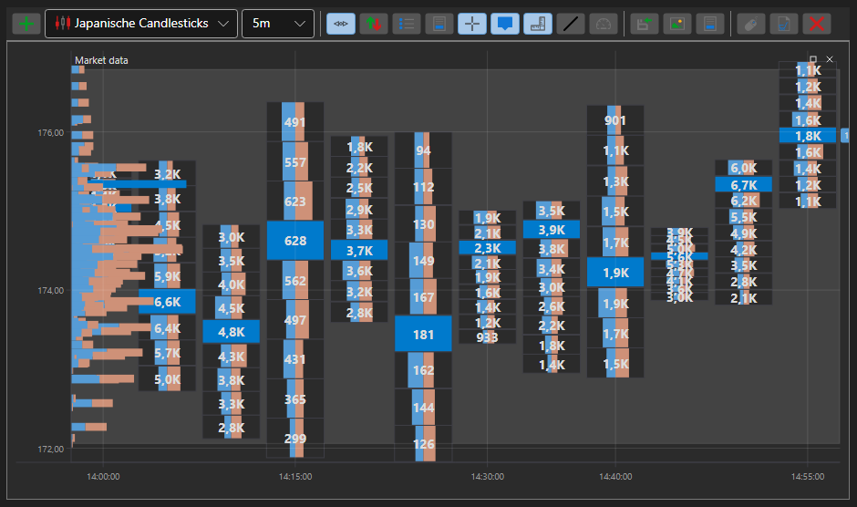

# Box-Chart

BoxChart ist ein spezieller Diagrammtyp zur Anzeige von Volumina als Zahlengitter. Um diesen Diagrammtyp zu verwenden, müssen Sie den speziellen Stil [ChartCandleElement.DrawStyle](xref:StockSharp.Xaml.Charting.ChartCandleElement.DrawStyle) \= [ChartCandleDrawStyles.BoxVolume](xref:StockSharp.Charting.ChartCandleDrawStyles.BoxVolume) setzen. Dieses Diagramm verwendet die Informationen aus der Eigenschaft [PriceLevels](xref:StockSharp.Messages.CandleMessage.PriceLevels) als Quelldaten.

**Haupteigenschaften**

- [ChartCandleElement.Timeframe2Multiplier](xref:StockSharp.Xaml.Charting.ChartCandleElement.Timeframe2Multiplier) - Multiplikator, der auf den im Konstruktor angegebenen Hauptzeitrahmen angewendet wird, um einen zweiten Zeitrahmen zu erhalten. Die angezeigten Kerzen werden zu Gruppen zusammengefasst, deren Größe dem zweiten Zeitrahmen entspricht. Die Gruppen werden im Diagramm mit Gitter und Rahmen in den jeweiligen Farben gezeichnet.
- [ChartCandleElement.Timeframe3Multiplier](xref:StockSharp.Xaml.Charting.ChartCandleElement.Timeframe3Multiplier) - analog zu [ChartCandleElement.Timeframe2Multiplier](xref:StockSharp.Xaml.Charting.ChartCandleElement.Timeframe2Multiplier), aber für den dritten Zeitrahmen. Der dritte Zeitrahmen wird im Diagramm mit dem Gitter der entsprechenden Farbe gezeichnet.
- [ChartCandleElement.FontColor](xref:StockSharp.Xaml.Charting.ChartCandleElement.FontColor) - Farbe der Volumenwerte im Diagramm.
- [ChartCandleElement.MaxVolumeColor](xref:StockSharp.Xaml.Charting.ChartCandleElement.MaxVolumeColor) - Farbe der Volumenwerte im Diagramm für das maximale Volumen in der angegebenen Kerze.
- [ChartCandleElement.Timeframe2Color](xref:StockSharp.Xaml.Charting.ChartCandleElement.Timeframe2Color) - Gitterfarbe des zweiten Zeitrahmens.
- [ChartCandleElement.Timeframe2FrameColor](xref:StockSharp.Xaml.Charting.ChartCandleElement.Timeframe2FrameColor) - Rahmenfarbe des zweiten Zeitrahmens.
- [ChartCandleElement.Timeframe3Color](xref:StockSharp.Xaml.Charting.ChartCandleElement.Timeframe3Color) - Gitterfarbe des dritten Zeitrahmens.

Ein Beispiel für die Verwendung dieses Diagrammtyps befindet sich in *Samples/Common/SampleChart*.

> [!TIP]
> Um zwischen Diagrammtypen zu wechseln, verwenden Sie die Einstellungsschaltfläche (Zahnrad) in der oberen linken Ecke des Diagramms.
