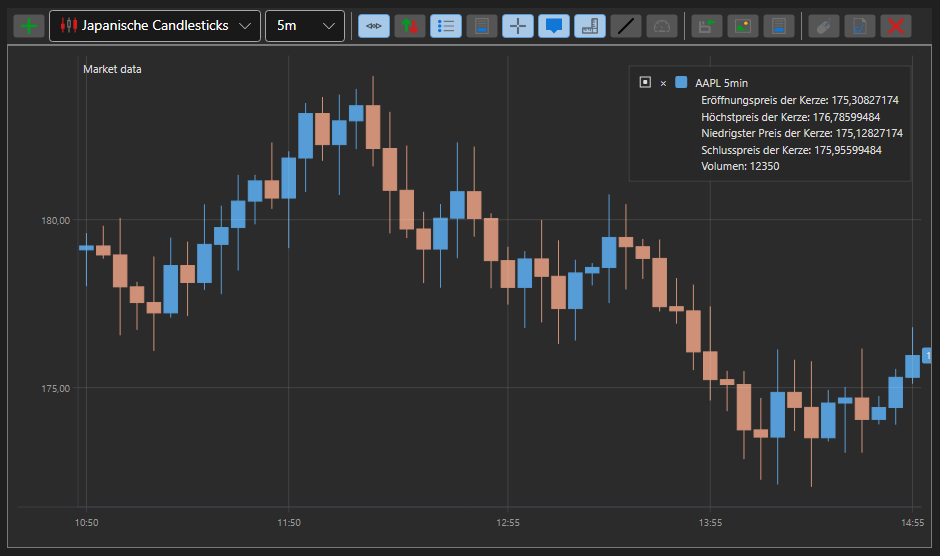

# Kerzendiagramm

[Chart](xref:StockSharp.Xaml.Charting.Chart) ist eine grafische Komponente zum Erstellen von Börsendiagrammen: Kerzen, Indikatoren sowie Order- und Trade-Marker in Diagrammen.

Unten sehen Sie ein Beispiel für den Aufbau eines Diagramms mit der Komponente [Chart](xref:StockSharp.Xaml.Charting.Chart). Das Beispiel basiert auf Samples/02_Candles/01_Realtime mit einigen Änderungen.



## Beispiel für den Aufbau eines Diagramms mit Chart

1. In XAML erstellen wir ein Fenster und fügen die grafische Komponente [Chart](xref:StockSharp.Xaml.Charting.Chart) hinzu. Wir weisen der Komponente den Namen **Chart** zu. Beachten Sie, dass beim Erstellen des Fensters der Namespace *http:\/\/schemas.stocksharp.com\/xaml* hinzugefügt werden muss.

   ```xaml
   <Window x:Class="SampleCandles.ChartWindow"
           xmlns="http://schemas.microsoft.com/winfx/2006/xaml/presentation"
           xmlns:x="http://schemas.microsoft.com/winfx/2006/xaml"
           xmlns:charting="http://schemas.stocksharp.com/xaml"
           Title="ChartWindow" Height="300" Width="300">
      <charting:Chart x:Name="Chart" x:FieldModifier="public" />
   </Window>
   ```

2. Im Code des Hauptfensters deklarieren wir Variablen für Diagrammbereiche, Diagrammelemente, Indikatoren und Abonnements.

   ```cs
   private readonly Dictionary<Subscription, ChartWindow> _chartWindows = new Dictionary<Subscription, ChartWindow>();
   private readonly Connector _connector = new Connector();
   private readonly LogManager _logManager;
   private ChartArea _candlesArea;
   private ChartArea _indicatorsArea;
   private ChartIndicatorElement _smaChartElement;
   private ChartIndicatorElement _macdChartElement;
   private ChartCandleElement _candlesElem;
   private SimpleMovingAverage _sma;
   private MovingAverageConvergenceDivergence _macd;
   ```

3. Im **Click**-Ereignishandler der Schaltfläche **Connect** abonnieren wir neben den Connector-Ereignissen und dem Aufruf der Methode [IConnector.Connect](xref:StockSharp.BusinessEntities.IConnector.Connect) auch das Ereignis [Connector.CandleReceived](xref:StockSharp.Algo.Connector.CandleReceived). In diesem Ereignishandler wird das Diagramm gezeichnet, wenn eine neue Kerze empfangen wird.

   ```cs
   private void ConnectClick(object sender, RoutedEventArgs e)
   {
       _connector.CandleReceived += OnCandleReceived;

       // Weitere erforderliche Ereignisse abonnieren
       _connector.Connected += () => this.GuiAsync(() => { /* Verbindung verarbeiten */ });
       _connector.Disconnected += () => this.GuiAsync(() => { /* Trennung verarbeiten */ });

       // Mit dem Handelssystem verbinden
       _connector.Connect();
   }
   ```

4. Im Handler der Schaltfläche **ShowChart** erstellen wir Indikatorobjekte, Bereiche und Diagrammelemente. Wir fügen Elemente zu Bereichen und Bereiche zum Diagramm hinzu. Dann öffnen wir das Diagrammfenster und starten ein Kerzenabonnement.

   ```cs
   private void ShowChartClick(object sender, RoutedEventArgs e)
   {
       var security = SelectedSecurity;

       // Kerzenabonnement erstellen
       var subscription = new Subscription(
           DataType.TimeFrame(TimeSpan.FromMinutes(5)),
           security)
       {
           MarketData =
           {
               // Historische Daten für 30 Tage anfordern
               From = DateTime.Today.Subtract(TimeSpan.FromDays(30)),
               To = DateTime.Now,
               // Nur abgeschlossene Kerzen abrufen
               IsFinishedOnly = true
           }
       };

       // Diagrammfenster erstellen
       _chartWindows.SafeAdd(subscription, key =>
       {
           var wnd = new ChartWindow
           {
               Title = $"{security.Code} {TimeSpan.FromMinutes(5)}"
           };
           wnd.MakeHideable();

           // Indikatoren initialisieren
           _sma = new SimpleMovingAverage() { Length = 11 };
           _macd = new MovingAverageConvergenceDivergence();

           // Diagrammelemente initialisieren
           _smaChartElement = new ChartIndicatorElement();
           _macdChartElement = new ChartIndicatorElement();
           _candlesElem = new ChartCandleElement();

           // MACD-Anzeigestil als Histogramm setzen
           _macdChartElement.DrawStyle = DrawStyles.Histogram;

           // Diagrammbereiche initialisieren
           _candlesArea = new ChartArea();
           _indicatorsArea = new ChartArea();

           // Bereiche zum Diagramm hinzufügen
           wnd.Chart.Areas.Add(_candlesArea);
           wnd.Chart.Areas.Add(_indicatorsArea);

           // Elemente zu Bereichen hinzufügen
           _candlesArea.Elements.Add(_candlesElem);
           _candlesArea.Elements.Add(_smaChartElement);
           _indicatorsArea.Elements.Add(_macdChartElement);

           // Diagrammelemente für automatisches Zeichnen an das Abonnement binden
           wnd.Chart.AddElement(_candlesArea, _candlesElem, subscription);
           wnd.Chart.AddElement(_candlesArea, _smaChartElement, subscription);
           wnd.Chart.AddElement(_indicatorsArea, _macdChartElement, subscription);

           return wnd;
       }).Show();

       // Kerzenabonnement starten
       _connector.Subscribe(subscription);
   }
   ```

5. Im Ereignishandler [Connector.CandleReceived](xref:StockSharp.Algo.Connector.CandleReceived) zeichnen wir die Kerze und die Indikatorwerte für jede abgeschlossene Kerze.

   ```cs
   private void OnCandleReceived(Subscription subscription, ICandleMessage candle)
   {
       var wnd = _chartWindows.TryGetValue(subscription);
       if (wnd == null)
           return;

       // Nur abgeschlossene Kerzen verarbeiten
       if (candle.State != CandleStates.Finished)
           return;

       // Indikatorwerte berechnen
       var smaValue = _sma.Process(candle);
       var macdValue = _macd.Process(candle);

       // Daten zum Zeichnen erstellen
       var data = new ChartDrawData();
       data
           .Group(candle.OpenTime)
               .Add(_candlesElem, candle)
               .Add(_smaChartElement, smaValue)
               .Add(_macdChartElement, macdValue);

       // Daten im UI-Thread in das Diagramm zeichnen
       this.GuiAsync(() => wnd.Chart.Draw(data));
   }
   ```

## Beispiel mit automatischem Zeichnen des Diagramms

Ab den neueren Versionen von StockSharp ist es möglich, das automatische Zeichnen von Diagrammen einzurichten, ohne die Draw-Methode explizit aufzurufen. Dazu wird bei der Konfiguration von Chart die AddElement-Methode verwendet, die das Diagrammelement mit einem Abonnement verknüpft:

```cs
private void SetupAutoDrawingChart()
{
	var security = SelectedSecurity;

	// Diagrammelemente erstellen
	var candleElement = new ChartCandleElement();
	var smaElement = new ChartIndicatorElement { Title = "SMA" };

	// Diagrammbereiche erstellen
	var area = new ChartArea();

	// Bereich zum Diagramm hinzufügen
	Chart.Areas.Add(area);

	// Kerzenabonnement erstellen
	var subscription = new Subscription(
		DataType.TimeFrame(TimeSpan.FromMinutes(5)),
		security)
	{
		MarketData =
		{
			From = DateTime.Today.Subtract(TimeSpan.FromDays(30)),
			To = DateTime.Now
		}
	};

	// Elemente an Diagrammbereich und Abonnement binden
	Chart.AddElement(area, candleElement, subscription);
	Chart.AddElement(area, smaElement, subscription);

	// Indikator erstellen
	var sma = new SimpleMovingAverage { Length = 14 };

	// Ereignis für Kerzenempfang zur Indikatorverarbeitung abonnieren
	_connector.CandleReceived += (sub, candle) =>
	{
		if (sub == subscription && candle.State == CandleStates.Finished)
		{
			// Kerze mit dem Indikator verarbeiten und Wert abrufen
			var smaValue = sma.Process(candle);

			// Indikatorwert zeichnen
			var data = new ChartDrawData();
			data
				.Group(candle.OpenTime)
					.Add(smaElement, smaValue);

			this.GuiAsync(() => Chart.Draw(data));
		}
	};

	// Abonnement starten
	_connector.Subscribe(subscription);
}
```

## Orders und Trades im Diagramm anzeigen

Sie können Order- und Trade-Marker direkt im Diagramm anzeigen:

```cs
// Elemente zur Anzeige von Orders und Trades erstellen
var orderElement = new ChartOrderElement();
var tradeElement = new ChartTradeElement();

// Elemente zum Diagrammbereich hinzufügen
_candlesArea.Elements.Add(orderElement);
_candlesArea.Elements.Add(tradeElement);

// Ereignisse für Order- und Trade-Empfang abonnieren
_connector.OrderReceived += (sub, order) =>
{
	if (order.Security != _security)
		return;

	// Order im Diagramm zeichnen
	var data = new ChartDrawData();
	data.Group(order.Time).Add(orderElement, order);

	this.GuiAsync(() => Chart.Draw(data));
};

_connector.OwnTradeReceived += (sub, trade) =>
{
	if (trade.Order.Security != _security)
		return;

	// Trade im Diagramm zeichnen
	var data = new ChartDrawData();
	data.Group(trade.Time).Add(tradeElement, trade);

	this.GuiAsync(() => Chart.Draw(data));
};
```

## Diagramm leeren

Zum Leeren des Diagramms können Sie die Reset-Methode verwenden:

```cs
// Gesamtes Diagramm leeren
Chart.Reset();

// Bestimmten Bereich leeren
_candlesArea.Reset();

// Bestimmtes Element leeren
_candlesElem.Reset();
```
