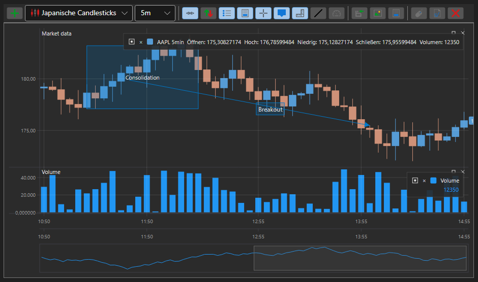
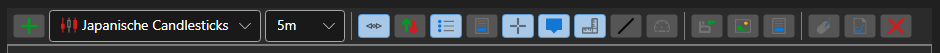

# Kerzendiagramm-Panel

[ChartPanel](xref:StockSharp.Xaml.Charting.ChartPanel) ist eine erweiterte Komponente zum Erstellen von Börsendiagrammen. Sie verfügt über eine Symbolleiste und zusätzliche Funktionen. Die Diagrammerstellung mit [ChartPanel](xref:StockSharp.Xaml.Charting.ChartPanel) unterscheidet sich nicht wesentlich von der Arbeit mit [Chart](candle_chart.md).

Die folgenden Abbildungen zeigen das Aussehen der Komponente sowie die Funktionen der Schaltflächen in der Symbolleiste.

1 - Horizontale Linie;

2 - Vertikale Linie;

3 - Hinweis;

4 - Trendlinie;

5 - Bereich;

6 - Dies ist ein Text.

**Funktionen der Symbolleiste**

1 - Panel hinzufügen;

2 - Autoscrolling aktivieren;

3 - Autoskalierung aktivieren;

4 - Legende aktivieren;

5 - Vorschaubereich aktivieren;

6 - Fadenkreuz aktivieren;

7 - Hinweis für Balken aktivieren;

8 - Werte auf der Achse anzeigen;

9 - Trendlinie zeichnen;

10 - Zeiger zeichnen;

11 - Vertikale Linie zeichnen;

12 - Horizontale Linie zeichnen;

13 - Bereich auswählen;

14 - Textbeschriftung;

15 - FPS-Statistik anzeigen;

16 - Orders registrieren;

17 - Daten speichern;

18 - Veröffentlichen;
