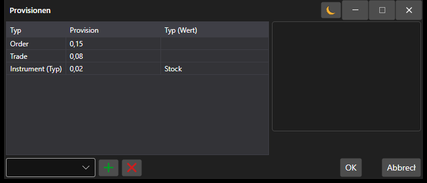

# Fenster für Provisionseinstellungen

[CommissionWindow](xref:StockSharp.Xaml.CommissionWindow) ist ein spezielles Fenster zum Festlegen der Regeln für die Berechnung von Provisionen.



Unten sehen Sie ein Codebeispiel zum Aufrufen eines Fensters für die Festlegung von Provisionsregeln.

```cs
		private void RiskButton_OnClick(object sender, RoutedEventArgs e)
		{
			var wnd = new CommissionWindow();
			wnd.Rules.AddRange(Strategy.RiskManager.Rules.Select(r => r.Clone()));
			if (!wnd.ShowModal(this))
				return;
			Strategy.RiskManager.Rules.Clear();
			Strategy.RiskManager.Rules.AddRange(wnd.Rules);
		}

```
