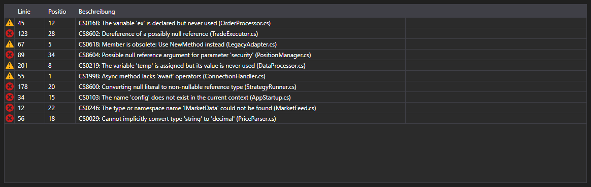

# Kompilierungsfehler



[ErrorsGrid](xref:StockSharp.Xaml.Code.ErrorsGrid) - eine Tabelle der Kompilierungsfehler. Für jeden [CompilationError](xref:Ecng.Compilation.CompilationError)\-Eintrag zeigt sie die Art (Fehler, Warnung, Meldung), die Zeile, die Position in der Zeile und den Text.

**Haupteigenschaften**

- [ErrorsGrid.Errors](xref:StockSharp.Xaml.Code.ErrorsGrid.Errors) - Liste der Kompilierungsfehler.

Das Ereignis `ErrorSelected` wird beim Doppelklick auf eine Zeile ausgelöst \- der Code-Editor setzt daraufhin die Einfügemarke auf diese Zeile. So bilden Tabelle und Editor das gewohnte Paar aus Fehlerliste und Sprung zur Fehlerstelle.

Nachfolgend Codeausschnitte zur Verwendung:

```xaml
<Window x:Class="Sample.CompilationWindow"
	xmlns="http://schemas.microsoft.com/winfx/2006/xaml/presentation"
	xmlns:x="http://schemas.microsoft.com/winfx/2006/xaml"
	xmlns:code="clr-namespace:StockSharp.Xaml.Code;assembly=StockSharp.Xaml"
	Height="200" Width="800">
	<code:ErrorsGrid x:Name="ErrorsGrid" />
</Window>
```

```cs
// Ergebnis der Kompilierung anzeigen
var result = compiler.Compile("Strategy", sources, references);

ErrorsGrid.Errors.Clear();
ErrorsGrid.Errors.AddRange(result.Errors);

// Per Doppelklick zur Fehlerzeile springen
ErrorsGrid.ErrorSelected += error => CodePanel.Code.SelectLine(error.Line);
```

## Siehe auch

[Diagnostik](../diagnostics.md)
