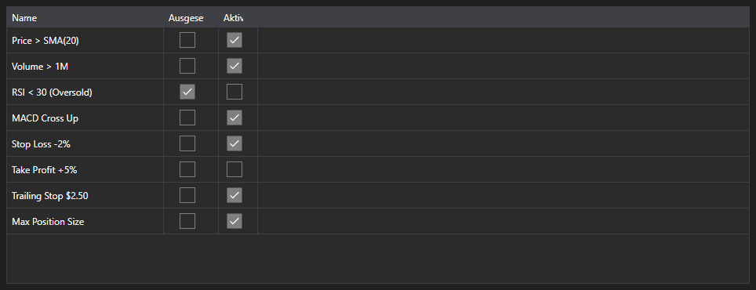

# Aktive Regeln



[MarketRuleGrid](xref:StockSharp.Xaml.MarketRuleGrid) - eine Tabelle der von einer Strategie oder einem Connector erzeugten [IMarketRule](xref:StockSharp.Algo.IMarketRule)\-Regeln. Sie zeigt den Regelnamen sowie die Kennzeichen für Pausiert und Aktiv.

**Haupteigenschaften**

- [MarketRuleGrid.Rules](xref:StockSharp.Xaml.MarketRuleGrid.Rules) - Liste der Regeln; üblicherweise [Strategy.Rules](xref:StockSharp.Algo.Strategies.Strategy.Rules).

Die Tabelle hilft dort, wo es viele Regeln gibt und man wissen muss, welche noch leben. Eine Regel verschwindet aus der Liste, sobald sie ausgelöst und entfernt wurde \- ein Leck fällt daher sofort auf: eine Regel, die hätte entfernt werden müssen, aber geblieben ist.

Nachfolgend Codeausschnitte zur Verwendung:

```xaml
<Window x:Class="Sample.RulesWindow"
	xmlns="http://schemas.microsoft.com/winfx/2006/xaml/presentation"
	xmlns:x="http://schemas.microsoft.com/winfx/2006/xaml"
	xmlns:xaml="http://schemas.stocksharp.com/xaml"
	Height="300" Width="600">
	<xaml:MarketRuleGrid x:Name="RuleGrid" />
</Window>
```

```cs
// Regeln der Strategie anzeigen
RuleGrid.Rules = _strategy.Rules;

// Jede erzeugte Regel erscheint in der Tabelle
_strategy
	.WhenPositionChanged()
	.Do(() => LogInfo("position={0}", _strategy.Position))
	.Apply(_strategy);
```

## Siehe auch

[Diagnostik](../diagnostics.md)
