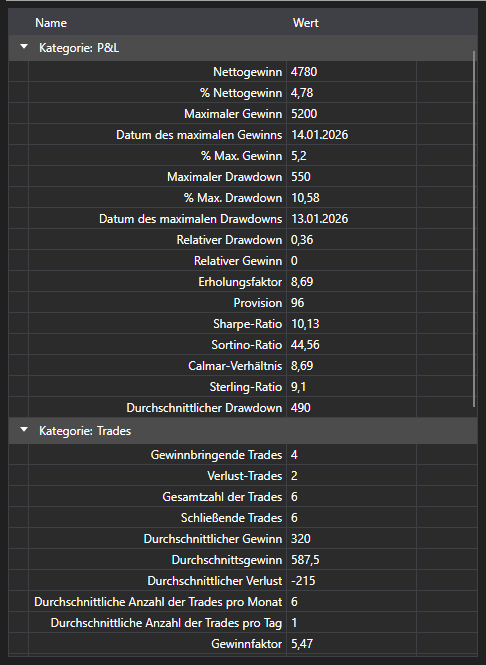

# Strategiestatistik



[StatisticParameterGrid](xref:StockSharp.Xaml.StatisticParameterGrid) - eine Tabelle der Statistikparameter [IStatisticParameter](xref:StockSharp.Algo.Statistics.IStatisticParameter) einer einzelnen Strategie. Die Parameter sind nach Kategorien gruppiert (Trades, Orders, Rendite, Drawdown), und jede Zeile zeigt den Namen, den aktuellen Wert und die Beschreibung.

**Wichtigste Eigenschaften und Methoden**

- [StatisticParameterGrid.StatisticManager](xref:StockSharp.Xaml.StatisticParameterGrid.StatisticManager) - der Statistikmanager, dessen Parameter die Tabelle anzeigt. Üblicherweise ist das [Strategy.StatisticManager](xref:StockSharp.Algo.Strategies.Strategy.StatisticManager).
- [StatisticParameterGrid.Parameters](xref:StockSharp.Xaml.StatisticParameterGrid.Parameters) - die Liste der Parameter, wenn sie unmittelbar und nicht über den Manager gesetzt wird.
- [StatisticParameterGrid.Reset](xref:StockSharp.Xaml.StatisticParameterGrid.Reset) - setzt die gesammelten Werte zurück.

Die Werte werden im Verlauf der Strategie fortlaufend aktualisiert, deshalb stellt man die Tabelle neben das Diagramm: Das Diagramm zeigt, wie der Handel verlaufen ist, die Tabelle, was er gekostet hat. Wird dieselbe Berechnung erneut gestartet, muss `Reset` aufgerufen werden, sonst legen sich die neuen Werte über die alten.

Anders als [StrategiesStatisticsPanel](xref:StockSharp.Xaml.StrategiesStatisticsPanel), das mehrere Strategien anhand derselben Spalten vergleicht, zerlegt diese Tabelle eine einzelne Strategie vollständig.

Nachfolgend Codeausschnitte zur Verwendung:

```xaml
<Window x:Class="Sample.StatisticsWindow"
	xmlns="http://schemas.microsoft.com/winfx/2006/xaml/presentation"
	xmlns:x="http://schemas.microsoft.com/winfx/2006/xaml"
	xmlns:xaml="http://schemas.stocksharp.com/xaml"
	Height="500" Width="400">
	<xaml:StatisticParameterGrid x:Name="StatisticGrid" />
</Window>
```

```cs
// Statistik der Strategie anzeigen
StatisticGrid.StatisticManager = _strategy.StatisticManager;

// Vor einem erneuten Lauf die gesammelten Werte zurücksetzen
StatisticGrid.Reset();
```

## Siehe auch

[Diagnostik](../diagnostics.md)

[Statistik](../strategies/statistics.md)
