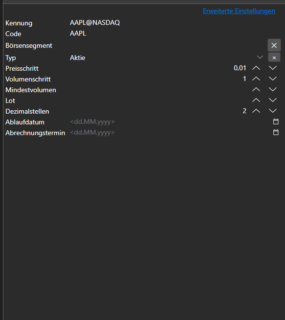
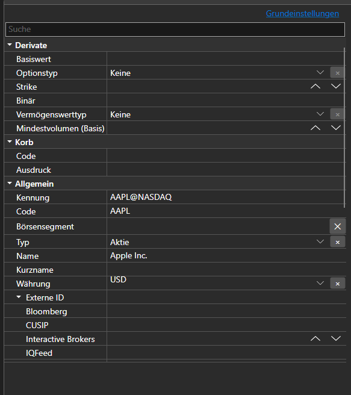

# Basis- und erweiterte Eigenschaften





[BasicAdvPropertiesPanel](xref:StockSharp.Xaml.PropertyGrid.BasicAdvPropertiesPanel) - ein Eigenschaftenpanel mit zwei Modi. Der Basismodus zeigt eine kurze Liste der Pflichtfelder, der erweiterte Modus alle nach Kategorien gruppierten Eigenschaften des Objekts.

**Haupteigenschaften**

- [BasicAdvPropertiesPanel.SelectedObject](xref:StockSharp.Xaml.PropertyGrid.BasicAdvPropertiesPanel.SelectedObject) - bearbeitetes Objekt.
- [BasicAdvPropertiesPanel.IsAdvancedMode](xref:StockSharp.Xaml.PropertyGrid.BasicAdvPropertiesPanel.IsAdvancedMode) - Kennzeichen des erweiterten Modus.
- [BasicAdvPropertiesPanel.PlainMaxDepth](xref:StockSharp.Xaml.PropertyGrid.BasicAdvPropertiesPanel.PlainMaxDepth) - Aufklapptiefe verschachtelter Eigenschaften im Basismodus.
- [BasicAdvPropertiesPanel.PostImmediately](xref:StockSharp.Xaml.PropertyGrid.BasicAdvPropertiesPanel.PostImmediately) - Wert sofort bei der Eingabe übernehmen, ohne den Feldwechsel abzuwarten.

Die zwei Modi lösen das übliche Problem der Connector-Einstellungen: Pflichtfelder gibt es drei oder vier, Eigenschaften insgesamt mehrere Dutzend. Der Basismodus zeigt nur das, ohne das die Verbindung nicht zustande kommt; alles Weitere bleibt im erweiterten Modus erreichbar.

Nachfolgend Codeausschnitte zur Verwendung:

```xaml
<Window x:Class="Sample.SettingsWindow"
	xmlns="http://schemas.microsoft.com/winfx/2006/xaml/presentation"
	xmlns:x="http://schemas.microsoft.com/winfx/2006/xaml"
	xmlns:pg="clr-namespace:StockSharp.Xaml.PropertyGrid;assembly=StockSharp.Xaml"
	Height="500" Width="400">
	<pg:BasicAdvPropertiesPanel x:Name="PropertiesPanel" />
</Window>
```

```cs
// Eigenschaften des Adapters anzeigen
PropertiesPanel.SelectedObject = _adapter;

// In den erweiterten Modus wechseln
PropertiesPanel.IsAdvancedMode = true;

// Änderung der Einstellungen vermerken
PropertiesPanel.CellValueChanged += (sender, e) => _isModified = true;
```

## Siehe auch

[Werteditoren](../editors.md)
