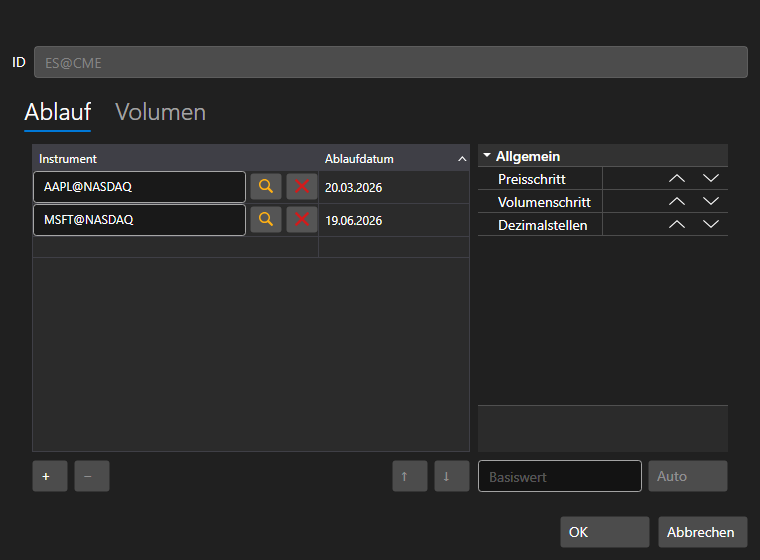

# Kontinuierliche Futures

[ContinuousSecurityWindow](xref:StockSharp.Xaml.ContinuousSecurityWindow) ist ein visueller Editor zum Erstellen *kontinuierlicher* ([ContinuousSecurity](xref:StockSharp.Algo.ContinuousSecurity)) Instrumente. Siehe [Kontinuierliche Futures](../../instruments/continuous_futures.md).



Diese Komponente umfasst:

- Ein spezielles Textfeld [SecurityIdTextBox](xref:StockSharp.Xaml.SecurityIdTextBox), das bei Eingabe der Id - \[Code\]@\[Board\] - ein *kontinuierliches* Instrument erzeugt.
- Die Komponente [SecurityJumpsEditor](xref:StockSharp.Xaml.SecurityJumpsEditor), ein spezielles DataGrid für die Arbeit mit Instrumenten, die Teil eines *kontinuierlichen* Instruments sind. Die Instrumente werden in die Klasse [SecurityJump](xref:StockSharp.Xaml.SecurityJump) verpackt, die zwei Eigenschaften besitzt: [SecurityJump.Security](xref:StockSharp.Xaml.SecurityJump.Security) und [SecurityJump.Date](xref:StockSharp.Xaml.SecurityJump.Date) (Roll Forward). Die hinzugefügten Instrumente werden in der Liste [SecurityJumpsEditor.Jumps](xref:StockSharp.Xaml.SecurityJumpsEditor.Jumps) gespeichert. Die Komponente verfügt über die Funktion [SecurityJumpsEditor.Validate](xref:StockSharp.Xaml.SecurityJumpsEditor.Validate), um die Korrektheit der Komponenteninstrumente zu prüfen.
- Schaltflächen zum Hinzufügen/Entfernen von Instrumenten.
- Die Schaltfläche **Auto** ermöglicht das automatische Erstellen eines *kontinuierlichen* Instruments.
- Die Schaltfläche **Ok** schließt die Erstellung eines *kontinuierlichen* Instruments ab.

**Haupteigenschaften**

- [ContinuousSecurityWindow.Security](xref:StockSharp.Xaml.ContinuousSecurityWindow.Security) - kontinuierliches Instrument
- [ContinuousSecurityWindow.SecurityStorage](xref:StockSharp.Xaml.ContinuousSecurityWindow.SecurityStorage) - Anbieter von Informationen über Instrumente.

Unten sehen Sie ein Codefragment zur Verwendung.

```cs
private void CreateContinuousSecurity_OnClick(object sender, RoutedEventArgs e)
{
	_continuousSecurityWindow = new ContinuousSecurityWindow
	{
		SecurityStorage = _entityRegistry.Securities,
		Security = new ContinuousSecurity { Board = ExchangeBoard.Associated }
	};
	if (!_continuousSecurityWindow.ShowModal(this))
		return;
	_continuousSecurity = _continuousSecurityWindow.Security;
	ContinuousSecurity.Content = _continuousSecurity.Id;
	var first = _continuousSecurity.InnerSecurities.First();
	var gluingSecurity = new Security
	{
		Id = _continuousSecurity.Id,
		Code = _continuousSecurity.Code,
		Board = ExchangeBoard.Associated,
		Type = _continuousSecurity.Type,
		VolumeStep = first.VolumeStep,
		PriceStep = first.PriceStep,
		ExtensionInfo = new Dictionary<object, object> { { "GluingSecurity", true } }
	};
	if (_entityRegistry.Securities.ReadById(gluingSecurity.Id) == null)
	{
		_entityRegistry.Securities.Save(gluingSecurity);
	}
}
```

## Empfohlene Inhalte

[Kontinuierliche Futures](../../../hydra/instruments_and_boards/continuous_futures.md)
