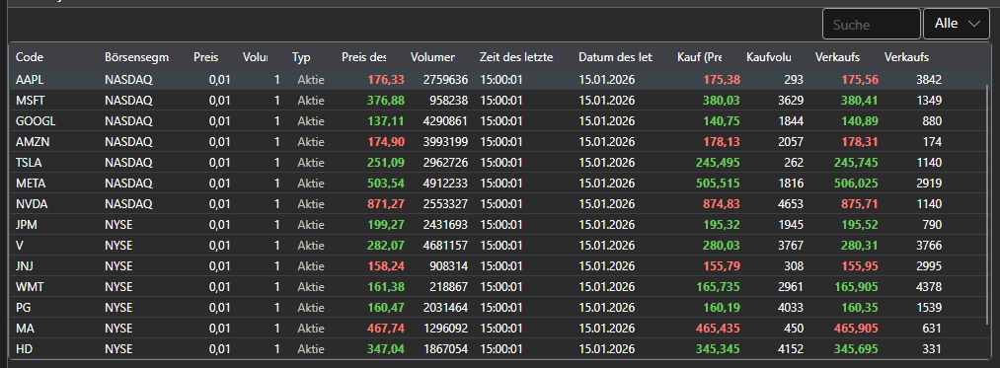

# Instrumentenauswahl

Die Komponente [SecurityPicker](xref:StockSharp.Xaml.SecurityPicker) dient zum Suchen und Auswählen von Instrumenten. Sie unterstützt sowohl Einzel- als auch Mehrfachauswahl. Die Komponente ermöglicht das Filtern der Instrumentenliste nach Typ. Sie kann außerdem zur Anzeige von Finanzinformationen (Level1-Felder) verwendet werden, wie im Abschnitt [SecurityGrid](table.md) gezeigt.



[SecurityPicker](xref:StockSharp.Xaml.SecurityPicker) besteht aus:

1. Einem Textfeld zur Eingabe des Codes (oder der Id) des Instruments. Während der Eingabe wird die Liste nach der eingegebenen Teilzeichenfolge gefiltert.
2. Der speziellen ComboBox [SecurityTypeComboBox](xref:StockSharp.Xaml.SecurityTypeComboBox) zum Filtern von Instrumenten nach Typ.
3. Der Tabelle [SecurityGrid](xref:StockSharp.Xaml.SecurityGrid) zur Anzeige der Instrumentenliste.

**Haupteigenschaften**

- [SecurityPicker.SelectionMode](xref:StockSharp.Xaml.SecurityPicker.SelectionMode) - Auswahlmodus für Instrumente: einzeln, mehrfach.
- [SecurityPicker.ShowCommonStatColumns](xref:StockSharp.Xaml.SecurityPicker.ShowCommonStatColumns) - Anzeige der Hauptspalten.
- [SecurityPicker.ShowCommonOptionColumns](xref:StockSharp.Xaml.SecurityPicker.ShowCommonOptionColumns) - Anzeige der Hauptspalten für Optionen.
- [SecurityPicker.Title](xref:StockSharp.Xaml.SecurityPicker.Title) - Titel, der oben in der Komponente angezeigt wird.
- [SecurityPicker.Securities](xref:StockSharp.Xaml.SecurityPicker.Securities) - Liste der Instrumente.
- [SecurityPicker.SelectedSecurity](xref:StockSharp.Xaml.SecurityPicker.SelectedSecurity) - ausgewähltes Instrument.
- [SecurityPicker.SelectedSecurities](xref:StockSharp.Xaml.SecurityPicker.SelectedSecurities) - Liste der ausgewählten Instrumente.
- [SecurityPicker.FilteredSecurities](xref:StockSharp.Xaml.SecurityPicker.FilteredSecurities) - Liste der gefilterten Instrumente.
- [SecurityPicker.ExcludeSecurities](xref:StockSharp.Xaml.SecurityPicker.ExcludeSecurities) - Liste der ausgeblendeten Instrumente.
- [SecurityPicker.SelectedType](xref:StockSharp.Xaml.SecurityPicker.SelectedType) - ausgewählter Instrumententyp.
- [SecurityPicker.SecurityProvider](xref:StockSharp.Xaml.SecurityPicker.SecurityProvider) - Anbieter von Informationen über Instrumente.
- [SecurityPicker.MarketDataProvider](xref:StockSharp.Xaml.SecurityPicker.MarketDataProvider) - Marktdatenanbieter.

Unten sehen Sie ein Codefragment zur Verwendung, entnommen aus dem Beispiel *Samples/InteractiveBrokers/SampleIB*.

```xaml
<Window x:Class="Sample.SecuritiesWindow"
	xmlns="http://schemas.microsoft.com/winfx/2006/xaml/presentation"
	xmlns:x="http://schemas.microsoft.com/winfx/2006/xaml"
	xmlns:loc="clr-namespace:StockSharp.Localization;assembly=StockSharp.Localization"
	xmlns:xaml="http://schemas.stocksharp.com/xaml"
	Title="{x:Static loc:LocalizedStrings.Securities}" Height="415" Width="1081">
	<Grid>
		<Grid.RowDefinitions>
			<RowDefinition Height="*" />
			<RowDefinition Height="Auto" />
		</Grid.RowDefinitions>
		<xaml:SecurityPicker x:Name="SecurityPicker" x:FieldModifier="public" SecuritySelected="SecurityPicker_OnSecuritySelected" ShowCommonStatColumns="True" />
	</Grid>
</Window>

```
```cs
private void ConnectClick(object sender, RoutedEventArgs e)
{
	......................................
	_connector.SecurityReceived += (sub, security) => _securitiesWindow.SecurityPicker.Securities.Add(security);
	_securitiesWindow.SecurityPicker.MarketDataProvider = _connector;
	......................................
}
private void SecurityPicker_OnSecuritySelected(Security security)
{
	NewStopOrder.IsEnabled = NewOrder.IsEnabled =
	Level1.IsEnabled = Depth.IsEnabled = security != null;
}
```
