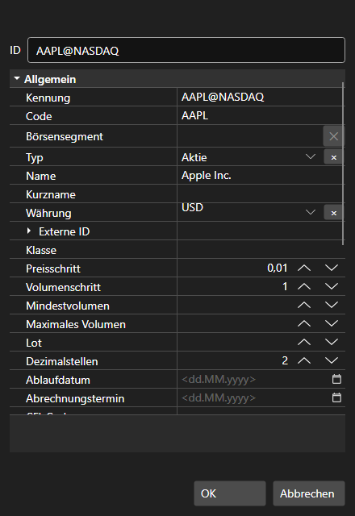

# Fenster

Die Komponente [SecurityCreateWindow](xref:StockSharp.Xaml.SecurityCreateWindow) ist ein Fenster zum Erstellen und Bearbeiten eines Instruments. Sie besteht aus zwei Hauptelementen: dem speziellen Textfeld [SecurityIdTextBox](xref:StockSharp.Xaml.SecurityIdTextBox) und dem Raster zur Eigenschaftsbearbeitung [PropertyGridEx](xref:StockSharp.Xaml.PropertyGrid.PropertyGridEx). Auf das erstellte bzw. bearbeitete Instrument können Sie über die Eigenschaft [SecurityCreateWindow.Security](xref:StockSharp.Xaml.SecurityCreateWindow.Security) zugreifen.

Unten sehen Sie das Aussehen der Komponente und ein Codefragment zur Verwendung.



```cs
private void Button_Click(object sender, RoutedEventArgs e)
{
	var dlg = new SecurityCreateWindow();
	var result = dlg.ShowDialog();
	if (result != null && (bool)result)
	{
		var security = dlg.Security;
	}
}

```
