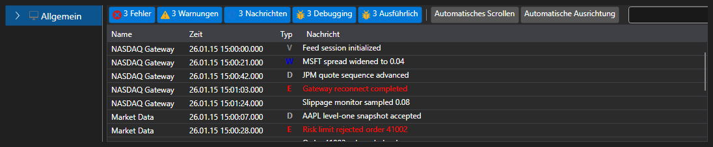

# Erweitertes Log-Panel

[Monitor](xref:StockSharp.Xaml.Monitor) ist ein visuelles Element, in dem [LogControl](log_panel.md) zusammen mit dem hierarchischen **TreeView**-Baum verwendet wird, in dem Logquellen angezeigt werden. Ursprünglich wurde die Komponente zur Überwachung von Handelsstrategien entwickelt. Daher enthält der "Baum" standardmäßig den Knoten **Strategy**. Gleichzeitig können mit dieser Komponente auch andere Quellen verwendet werden.



Beispielcode

```xaml
<Window x:Class="LoggingControls.MainWindow"
		xmlns="http://schemas.microsoft.com/winfx/2006/xaml/presentation"
		xmlns:x="http://schemas.microsoft.com/winfx/2006/xaml"
		xmlns:sx="clr-namespace:StockSharp.Xaml;assembly=StockSharp.Xaml"
		Title="MainWindow" Height="350" Width="525">
	<Grid>
		<sx:Monitor x:Name="Monitor" />
	</Grid>
</Window>

```
```cs
// Neue Instanz von LogManager erstellen
_logManager = new LogManager();
// .NET Tracing als Logquelle hinzufügen.
_logManager.Sources.Add(new Ecng.Logging.TraceSource());
// Monitor als Loglistener hinzufügen.
_logManager.Listeners.Add(new GuiLogListener(Monitor));

```
