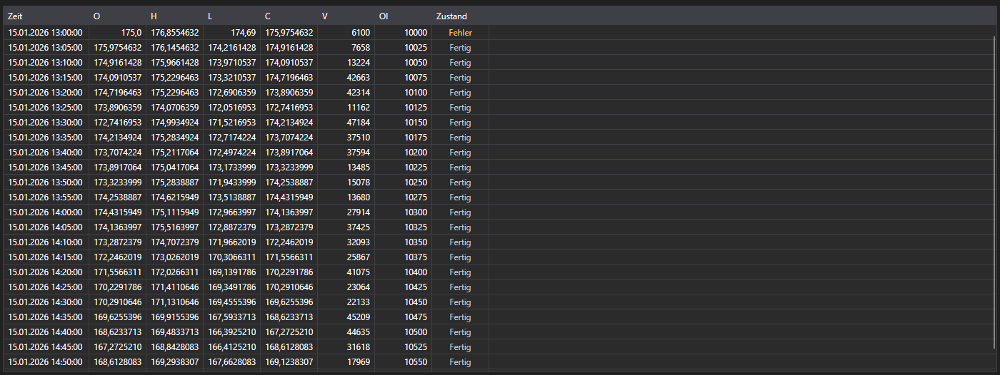

# Kerzen



[CandleMessageGrid](xref:StockSharp.Xaml.CandleMessageGrid) - eine Kerzentabelle. Sie zeigt Eröffnungs-, Höchst-, Tiefst- und Schlusskurse, die Volumina, das Open Interest und den Zustand jeder Kerze.

**Haupteigenschaften**

- [CandleMessageGrid.Messages](xref:StockSharp.Xaml.CandleMessageGrid.Messages) - Liste der Kerzen.
- [CandleMessageGrid.SelectedMessage](xref:StockSharp.Xaml.CandleMessageGrid.SelectedMessage) - ausgewählte Kerze.
- [CandleMessageGrid.SelectedMessages](xref:StockSharp.Xaml.CandleMessageGrid.SelectedMessages) - ausgewählte Kerzen.

## Kerzenzustände

Die Spalte **State** wird nach dem Wert von [CandleStates](xref:StockSharp.Messages.CandleStates) eingefärbt, und der Screenshot zeigt alle drei:

- **Active** - die Kerze bildet sich noch. Sie wird hervorgehoben, weil sich ihre Werte weiter ändern: eine solche Kerze darf nicht wie eine geschlossene gelesen werden.
- **Finished** - die Kerze ist geschlossen, ihre Werte sind endgültig. Neutrale Farbe, die meisten Zeilen der Tabelle sind so.
- **None** - es kam kein Zustand an. Die Tabelle beschriftet ihn als **Fehler** und färbt ihn als Warnung: das ist kein leerer Wert, sondern ein Zeichen für unvollständige Daten.

Eine Kerzen-Subskription, die in der ersten Zeile **Fehler** zeigt, meldet also ein Problem der Datenquelle und keine Kerze ohne Zustand.

Nachfolgend Codefragmente zur Verwendung:

```xaml
<Window x:Class="Sample.CandlesWindow"
	xmlns="http://schemas.microsoft.com/winfx/2006/xaml/presentation"
	xmlns:x="http://schemas.microsoft.com/winfx/2006/xaml"
	xmlns:xaml="http://schemas.stocksharp.com/xaml"
	Title="Kerzen" Height="400" Width="800">
	<xaml:CandleMessageGrid x:Name="CandleGrid" x:FieldModifier="public" />
</Window>
```

```cs
public class CandlesWindow
{
	private readonly Connector _connector;
	private readonly Security _security;
	private Subscription _candleSubscription;

	public CandlesWindow(Connector connector, Security security)
	{
		InitializeComponent();

		_connector = connector;
		_security = security;

		// Auf das Kerzen-Ereignis abonnieren
		_connector.CandleReceived += OnCandleReceived;

		// Subskription auf Fünf-Minuten-Kerzen anlegen
		_candleSubscription = new Subscription(TimeSpan.FromMinutes(5).TimeFrame(), security);

		// Subskription starten
		_connector.Subscribe(_candleSubscription);
	}

	// Handler für empfangene Kerzen
	private void OnCandleReceived(Subscription subscription, ICandleMessage candle)
	{
		// Prüfen, ob die Kerze zu unserer Subskription gehört
		if (subscription != _candleSubscription)
			return;

		// Kerze im UI-Thread in die Tabelle einfügen
		this.GuiAsync(() => CandleGrid.Messages.Add((CandleMessage)candle));
	}

	// Beim Schließen des Fensters abmelden
	public void Unsubscribe()
	{
		if (_candleSubscription != null)
		{
			_connector.CandleReceived -= OnCandleReceived;
			_connector.UnSubscribe(_candleSubscription);
			_candleSubscription = null;
		}
	}
}
```

### Nur abgeschlossene Kerzen

Bis eine Kerze schließt, trifft sie mehrfach ein, und die Tabelle wächst bei jeder Aktualisierung. Wenn nur die endgültigen Werte zählen, nach Zustand filtern:

```cs
private void OnCandleReceived(Subscription subscription, ICandleMessage candle)
{
	if (subscription != _candleSubscription)
		return;

	// Alles überspringen, was sich noch bildet
	if (candle.State != CandleStates.Finished)
		return;

	this.GuiAsync(() => CandleGrid.Messages.Add((CandleMessage)candle));
}
```

### Die aktuelle Kerze an Ort und Stelle aktualisieren

Damit die aktuelle Kerze in der Tabelle steht und aktualisiert statt erneut hinzugefügt wird, die letzte Zeile ersetzen, bis die Kerze schließt:

```cs
private void OnCandleReceived(Subscription subscription, ICandleMessage candle)
{
	if (subscription != _candleSubscription)
		return;

	var message = (CandleMessage)candle;

	this.GuiAsync(() =>
	{
		var last = CandleGrid.Messages.LastOrDefault();

		// Dieselbe Kerze wie die letzte Zeile - ersetzen
		if (last != null && last.OpenTime == message.OpenTime)
			CandleGrid.Messages[CandleGrid.Messages.Count - 1] = message;
		else
			CandleGrid.Messages.Add(message);
	});
}
```

### Historische Kerzen laden

```cs
// Historische Kerzen laden
public void LoadHistoricalCandles(Security security, TimeSpan timeFrame, DateTime from, DateTime to)
{
	// Aktuelle Kerzen löschen
	CandleGrid.Messages.Clear();

	// Subskription auf historische Kerzen anlegen
	var historySubscription = new Subscription(timeFrame.TimeFrame(), security)
	{
		MarketData =
		{
			// Zeitraum der historischen Daten angeben
			From = from,
			To = to
		}
	};

	_connector.CandleReceived += OnCandleReceived;
	_connector.Subscribe(historySubscription);
}
```

## Siehe auch

[Tick-Trades](ticks.md)
