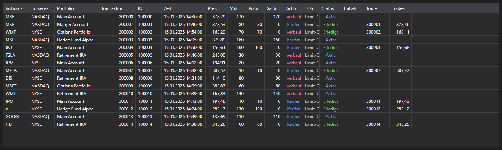

# Transaktionen und Trades



[ExecutionGrid](xref:StockSharp.Xaml.ExecutionGrid) - eine universelle Tabelle für [ExecutionMessage](xref:StockSharp.Messages.ExecutionMessage)\-Meldungen. Ein Steuerelement zeigt Ticks, Orderprotokoll und eigene Transaktionen \- die Datenart bestimmt [ExecutionMessage.DataTypeEx](xref:StockSharp.Messages.ExecutionMessage.DataTypeEx).

**Haupteigenschaften**

- [ExecutionGrid.Messages](xref:StockSharp.Xaml.ExecutionGrid.Messages) - Liste der Meldungen.
- [ExecutionGrid.SelectedMessage](xref:StockSharp.Xaml.ExecutionGrid.SelectedMessage) - ausgewählte Meldung.
- [ExecutionGrid.SelectedMessages](xref:StockSharp.Xaml.ExecutionGrid.SelectedMessages) - ausgewählte Meldungen.
- [ExecutionGrid.MaxCount](xref:StockSharp.Xaml.ExecutionGrid.MaxCount) - maximale Zeilenzahl der Tabelle; bei Überschreitung werden die ältesten Zeilen entfernt.

Da dieselbe Tabelle drei Datenarten bedient, werden nicht benötigte Spalten mit [ExecutionGrid.HideColumns](xref:StockSharp.Xaml.ExecutionGrid.HideColumns(StockSharp.Messages.DataType)) ausgeblendet: Ticks brauchen keine Orderspalten, das Orderprotokoll keine Spalten eigener Abschlüsse.

Nachfolgend Codeausschnitte zur Verwendung:

```xaml
<Window x:Class="Sample.ExecutionsWindow"
	xmlns="http://schemas.microsoft.com/winfx/2006/xaml/presentation"
	xmlns:x="http://schemas.microsoft.com/winfx/2006/xaml"
	xmlns:xaml="http://schemas.stocksharp.com/xaml"
	Height="400" Width="900">
	<xaml:ExecutionGrid x:Name="ExecutionGrid" />
</Window>
```

```cs
// Nur die Spalten der Transaktionen behalten
ExecutionGrid.HideColumns(DataType.Transactions);

// Orders im Oberflächen-Thread in die Tabelle eintragen
_connector.OrderReceived += (subscription, order) =>
	this.GuiAsync(() => ExecutionGrid.Messages.Add(order.ToMessage()));

// Tabellengröße begrenzen
ExecutionGrid.MaxCount = 100000;
```

## Siehe auch

[Marktdaten](../market_data.md)
