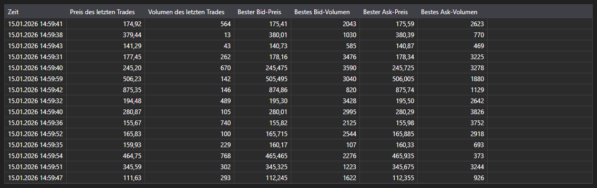

# Level1



[Level1Grid](xref:StockSharp.Xaml.Level1Grid) ist eine Tabelle zur Anzeige von Level1-Feldern. Diese Tabelle verwendet Daten in Form von [Level1ChangeMessage](xref:StockSharp.Messages.Level1ChangeMessage)-Meldungen.

**Haupteigenschaften**

- [Level1Grid.MaxCount](xref:StockSharp.Xaml.Level1Grid.MaxCount) - maximale Anzahl der anzuzeigenden Meldungen.
- [Level1Grid.Messages](xref:StockSharp.Xaml.Level1Grid.Messages) - Liste der zur Tabelle hinzugefügten Meldungen.
- [Level1Grid.SelectedMessage](xref:StockSharp.Xaml.Level1Grid.SelectedMessage) - ausgewählte Meldung.
- [Level1Grid.SelectedMessages](xref:StockSharp.Xaml.Level1Grid.SelectedMessages) - ausgewählte Meldungen.

Unten sehen Sie Codefragmente, die die Verwendung demonstrieren:

```xaml
<Window x:Class="Membrane02.Level1Window"
		xmlns="http://schemas.microsoft.com/winfx/2006/xaml/presentation"
		xmlns:x="http://schemas.microsoft.com/winfx/2006/xaml"
		xmlns:d="http://schemas.microsoft.com/expression/blend/2008"
		xmlns:mc="http://schemas.openxmlformats.org/markup-compatibility/2006"
		xmlns:sx="http://schemas.stocksharp.com/xaml"
		xmlns:local="clr-namespace:Membrane02"
		mc:Ignorable="d"
		Title="Level1-Fenster" Height="300" Width="300" Closing="Window_Closing">
	<Grid>
		<sx:Level1Grid x:Name="Level1Grid" />
	</Grid>
</Window>
```

```cs
public Level1Window()
{
	InitializeComponent();
	_connector = MainWindow.This.Connector;

	// Ereignis für den Empfang von Level1-Daten abonnieren
	_connector.Level1Received += OnLevel1Received;

	// Level1-Abonnement erstellen, falls noch nicht abonniert
	var security = MainWindow.This.SelectedSecurity;
	if (!_connector.Subscriptions.Any(s =>
			s.DataType == DataType.Level1 &&
			s.SecurityId == security.ToSecurityId()))
	{
		var subscription = new Subscription(DataType.Level1, security);
		_connector.Subscribe(subscription);
	}
}

private void OnLevel1Received(Subscription subscription, Level1ChangeMessage level1Message)
{
	// Prüfen, ob die Meldung zum ausgewählten Instrument gehört
	if (level1Message.SecurityId != MainWindow.This.SelectedSecurity.ToSecurityId())
		return;

	// Meldung zu Level1Grid hinzufügen
	this.GuiAsync(() => Level1Grid.Messages.Add(level1Message));
}

private void Window_Closing(object sender, System.ComponentModel.CancelEventArgs e)
{
	// Beim Schließen des Fensters Ereignisse abbestellen
	if (_connector != null)
		_connector.Level1Received -= OnLevel1Received;
}
```

### Empfohlene Verarbeitung von Level1-Daten

```cs
// Level1-Abonnement für mehrere Instrumente erstellen
public void SubscribeToLevel1(IEnumerable<Security> securities)
{
	foreach (var security in securities)
	{
		var subscription = new Subscription(DataType.Level1, security);
		_connector.Subscribe(subscription);
	}

	// Ereignis für den Empfang von Level1-Daten abonnieren
	_connector.Level1Received += OnLevel1Received;
}

// Handler für das Ereignis zum Empfang von Level1-Daten
private void OnLevel1Received(Subscription subscription, Level1ChangeMessage level1Message)
{
	// Prüfen, ob diese konkrete Meldung verarbeitet werden soll
	if (IsLevel1Needed(subscription))
	{
		// GUI im UI-Thread aktualisieren
		this.GuiAsync(() =>
		{
			// Meldung zu Level1Grid hinzufügen
			Level1Grid.Messages.Add(level1Message);

			// Änderungen in Level1-Feldern verarbeiten
			foreach (var change in level1Message.Changes)
			{
				switch (change.Key)
				{
					case Level1Fields.LastTradePrice:
						// Änderung des letzten Handelspreises verarbeiten
						var lastPrice = (decimal)change.Value;
						Console.WriteLine($"Last price {security.Code}: {lastPrice}");
						break;

					case Level1Fields.BestBidPrice:
						// Änderung des besten Geldkurses verarbeiten
						var bestBid = (decimal)change.Value;
						Console.WriteLine($"Bestes Bid {security.Code}: {bestBid}");
						break;

					case Level1Fields.BestAskPrice:
						// Änderung des besten Briefkurses verarbeiten
						var bestAsk = (decimal)change.Value;
						Console.WriteLine($"Bestes Ask {security.Code}: {bestAsk}");
						break;
				}
			}
		});
	}
}
```
