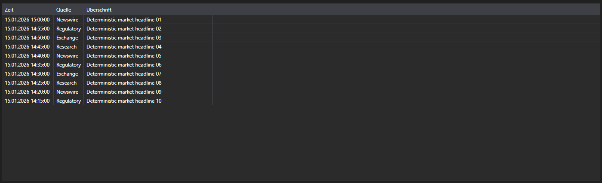
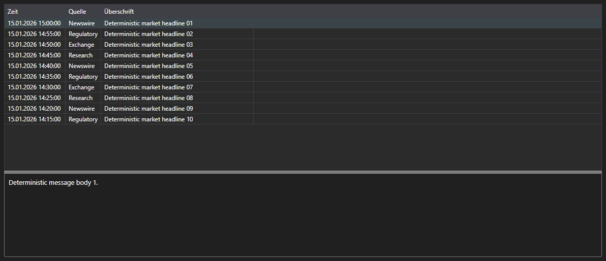

# Nachrichten als Meldungen





[NewsMessageGrid](xref:StockSharp.Xaml.NewsMessageGrid) - eine Nachrichtentabelle, die mit [NewsMessage](xref:StockSharp.Messages.NewsMessage)\-Meldungen statt mit Geschäftsobjekten arbeitet. Sie zeigt Zeit, Quelle, Kennung, Überschrift und den Link auf den vollständigen Text.

**Haupteigenschaften**

- [NewsMessageGrid.Messages](xref:StockSharp.Xaml.NewsMessageGrid.Messages) - Liste der Nachrichtenmeldungen.
- [NewsMessageGrid.SelectedMessage](xref:StockSharp.Xaml.NewsMessageGrid.SelectedMessage) - ausgewählte Meldung.
- [NewsMessageGrid.SelectedMessages](xref:StockSharp.Xaml.NewsMessageGrid.SelectedMessages) - ausgewählte Meldungen.
- [NewsMessageGrid.MaxCount](xref:StockSharp.Xaml.NewsMessageGrid.MaxCount) - maximale Zeilenzahl der Tabelle; bei Überschreitung werden die ältesten Zeilen entfernt.
- [NewsMessageGrid.SubscriptionProvider](xref:StockSharp.Xaml.NewsMessageGrid.SubscriptionProvider) - Abonnementanbieter, bei dem die Tabelle den vollständigen Nachrichtentext anfordert.

Die fertige Kombination aus Tabelle und Nachrichtentext ist [NewsMessagePanel](xref:StockSharp.Xaml.NewsMessagePanel). Es enthält [NewsMessageGrid](xref:StockSharp.Xaml.NewsMessageGrid) und [NewsStoryPanel](xref:StockSharp.Xaml.NewsStoryPanel): Bei Auswahl einer Zeile fordert das Panel den Text beim Abonnementanbieter an und zeigt ihn unten an.

Nachfolgend Codeausschnitte zur Verwendung:

```xaml
<Window x:Class="Sample.NewsWindow"
	xmlns="http://schemas.microsoft.com/winfx/2006/xaml/presentation"
	xmlns:x="http://schemas.microsoft.com/winfx/2006/xaml"
	xmlns:xaml="http://schemas.stocksharp.com/xaml"
	Height="400" Width="900">
	<xaml:NewsMessagePanel x:Name="NewsPanel" />
</Window>
```

```cs
// Abonnementanbieter setzen - darüber wird der Nachrichtentext angefordert
NewsPanel.SubscriptionProvider = _connector;

// Eingehende Nachrichten im Oberflächen-Thread in die Tabelle eintragen
_connector.NewsReceived += (subscription, news) =>
	this.GuiAsync(() => NewsPanel.NewsGrid.Messages.Add(news.ToMessage()));

// Nachrichtenabonnement anlegen
_connector.Subscribe(new Subscription(DataType.News));
```

## Siehe auch

[Marktdaten](../market_data.md)
