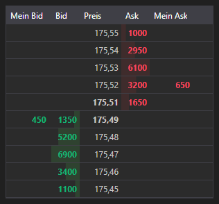

# Orderbuch



[MarketDepthControl](xref:StockSharp.Xaml.MarketDepthControl) - eine grafische Komponente zur Anzeige des Orderbuchs. Die Komponente kann Quotes und eigene Orders anzeigen.

**Wichtigste Eigenschaften und Methoden**

- [MarketDepthControl.MaxDepth](xref:StockSharp.Xaml.MarketDepthControl.MaxDepth) - Tiefe des Orderbuchs.
- [MarketDepthControl.IsBidsOnTop](xref:StockSharp.Xaml.MarketDepthControl.IsBidsOnTop) - Geldseiten oben anzeigen.
- [MarketDepthControl.UpdateFormat](xref:StockSharp.Xaml.MarketDepthControl.UpdateFormat(StockSharp.BusinessEntities.Security))**(**[StockSharp.BusinessEntities.Security](xref:StockSharp.BusinessEntities.Security) security **)** - Format der Preis- und Volumenanzeige anhand des Instruments aktualisieren.
- [MarketDepthControl.ProcessOrder](xref:StockSharp.Xaml.MarketDepthControl.ProcessOrder(StockSharp.BusinessEntities.Order,System.Decimal,System.Decimal,StockSharp.Messages.OrderStates))**(**[StockSharp.BusinessEntities.Order](xref:StockSharp.BusinessEntities.Order) order, [System.Decimal](xref:System.Decimal) price, [System.Decimal](xref:System.Decimal) balance, [StockSharp.Messages.OrderStates](xref:StockSharp.Messages.OrderStates) state **)** - eine Order verarbeiten.
- [MarketDepthControl.UpdateDepth](xref:StockSharp.Xaml.MarketDepthControl.UpdateDepth(StockSharp.Messages.IOrderBookMessage,StockSharp.BusinessEntities.Security))**(**[StockSharp.Messages.IOrderBookMessage](xref:StockSharp.Messages.IOrderBookMessage) message, [StockSharp.BusinessEntities.Security](xref:StockSharp.BusinessEntities.Security) security **)** - Orderbuch anhand einer Nachricht aktualisieren.

Die folgenden Codefragmente zeigen die Verwendung:

```xaml
<Window x:Class="SampleBarChart.QuotesWindow"
	xmlns="http://schemas.microsoft.com/winfx/2006/xaml/presentation"
	xmlns:x="http://schemas.microsoft.com/winfx/2006/xaml"
	xmlns:xaml="http://schemas.stocksharp.com/xaml"
	Title="QuotesWindow" Height="600" Width="280">
	<xaml:MarketDepthControl x:Name="DepthCtrl" x:FieldModifier="public" />
</Window>
```

```cs
public class MarketDepthWindow
{
	private readonly Connector _connector;
	private readonly Security _security;
	private Subscription _depthSubscription;
	
	public MarketDepthWindow(Connector connector, Security security)
	{
		InitializeComponent();
		
		_connector = connector;
		_security = security;
		
		// Orderbuchformatierung konfigurieren
		DepthCtrl.UpdateFormat(security);
		
		// Empfangsereignis für Orderbücher abonnieren
		_connector.OrderBookReceived += OnMarketDepthReceived;
		
		// Subscription auf das Orderbuch für das ausgewählte Instrument erstellen
		_depthSubscription = new Subscription(DataType.MarketDepth, security);
		
		// Subscription starten
		_connector.Subscribe(_depthSubscription);
	}
	
	// Handler für das Empfangsereignis von Orderbüchern
	private void OnMarketDepthReceived(Subscription subscription, IOrderBookMessage depth)
	{
		// Prüfen, ob das Orderbuch zu unserer Subscription gehört
		if (subscription != _depthSubscription)
			return;
			
		// Orderbuch im UI-Thread aktualisieren
		this.GuiAsync(() => DepthCtrl.UpdateDepth(depth, _security));
	}
	
	// Methode zum Abbestellen beim Schließen des Fensters
	public void Unsubscribe()
	{
		if (_depthSubscription != null)
		{
			_connector.OrderBookReceived -= OnMarketDepthReceived;
			_connector.UnSubscribe(_depthSubscription);
			_depthSubscription = null;
		}
	}
}
```

### Eigene Orders im Orderbuch anzeigen

```cs
public class MarketDepthWithOrdersWindow
{
	private readonly Connector _connector;
	private readonly Security _security;
	
	public MarketDepthWithOrdersWindow(Connector connector, Security security)
	{
		InitializeComponent();
		
		_connector = connector;
		_security = security;
		
		// Orderbuchformatierung konfigurieren
		DepthCtrl.UpdateFormat(security);
		
		// Empfangsereignisse für Orderbücher und Orders abonnieren
		_connector.OrderBookReceived += OnMarketDepthReceived;
		_connector.OrderReceived += OnOrderReceived;
		
		// Subscription auf das Orderbuch erstellen
		var depthSubscription = new Subscription(DataType.MarketDepth, security);
		_connector.Subscribe(depthSubscription);
		
		// Bei Bedarf eine Subscription auf Orders erstellen
		var ordersSubscription = new Subscription(DataType.Transactions, null);
		_connector.Subscribe(ordersSubscription);
	}
	
	// Handler für das Empfangsereignis von Orderbüchern
	private void OnMarketDepthReceived(Subscription subscription, IOrderBookMessage depth)
	{
		if (depth.SecurityId != _security.ToSecurityId())
			return;
			
		// Orderbuch im UI-Thread aktualisieren
		this.GuiAsync(() => DepthCtrl.UpdateDepth(depth, _security));
	}
	
	// Handler für das Empfangsereignis von Orders
	private void OnOrderReceived(Subscription subscription, Order order)
	{
		if (order.Security != _security)
			return;
			
		// Order im Orderbuch anzeigen
		this.GuiAsync(() => DepthCtrl.ProcessOrder(
			order, 
			order.Price, 
			order.Balance, 
			order.State));
	}
}
```

### Beste Preise aus dem Orderbuch abrufen

```cs
// Methode zum Abrufen der besten Preise aus dem Orderbuch
public (decimal? BestBid, decimal? BestAsk) GetBestPrices(IOrderBookMessage depth)
{
	if (depth == null)
		return (null, null);
		
	var bestBid = depth.GetBestBid()?.Price;
	var bestAsk = depth.GetBestAsk()?.Price;
	
	return (bestBid, bestAsk);
}

// Verwenden der Methode zur Anzeige des Spreads
private void OnMarketDepthReceived(Subscription subscription, IOrderBookMessage depth)
{
	if (depth.SecurityId != _security.ToSecurityId())
		return;
		
	// Beste Preise abrufen
	var (bestBid, bestAsk) = GetBestPrices(depth);
	
	// Spread berechnen und anzeigen
	if (bestBid.HasValue && bestAsk.HasValue)
	{
		var spread = bestAsk.Value - bestBid.Value;
		var spreadPercent = bestBid.Value > 0 ? spread / bestBid.Value * 100 : 0;
		
		this.GuiAsync(() => 
		{
			SpreadLabel.Content = $"Spread: {spread:F2} ({spreadPercent:F2}%)";
		});
	}
	
	// Orderbuch aktualisieren
	this.GuiAsync(() => DepthCtrl.UpdateDepth(depth, _security));
}
```
