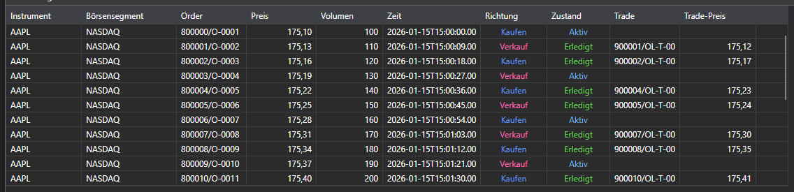

# Orderprotokoll



[OrderLogGrid](xref:StockSharp.Xaml.OrderLogGrid) - eine grafische Komponente zur Anzeige des Orderprotokolls ([OrderLogItem](xref:StockSharp.BusinessEntities.OrderLogItem)).

**Wichtigste Eigenschaften und Methoden**

- [OrderLogGrid.LogItems](xref:StockSharp.Xaml.OrderLogGrid.LogItems) - Liste der Orderprotokolleinträge.
- [OrderLogGrid.SelectedLogItem](xref:StockSharp.Xaml.OrderLogGrid.SelectedLogItem) - ausgewählter Orderprotokolleintrag.
- [OrderLogGrid.SelectedLogItems](xref:StockSharp.Xaml.OrderLogGrid.SelectedLogItems) - ausgewählte Orderprotokolleinträge.

Die folgenden Codefragmente zeigen die Verwendung:

```xaml
<Window x:Class="SampleITCH.OrdersLogWindow"
		xmlns="http://schemas.microsoft.com/winfx/2006/xaml/presentation"
		xmlns:x="http://schemas.microsoft.com/winfx/2006/xaml"
		xmlns:loc="clr-namespace:StockSharp.Localization;assembly=StockSharp.Localization"
		xmlns:xaml="http://schemas.stocksharp.com/xaml"
		Title="{x:Static loc:LocalizedStrings.OrderLog}" Height="750" Width="900">
	<xaml:OrderLogGrid x:Name="OrderLogGrid" x:FieldModifier="public" />
</Window>
```

```cs
public class OrderLogWindow
{
	private readonly Connector _connector;
	private readonly Security _security;
	private Subscription _orderLogSubscription;

	public OrderLogWindow(Connector connector, Security security)
	{
		InitializeComponent();

		_connector = connector;
		_security = security;

		// Empfangsereignis für Orderprotokolleinträge abonnieren
		_connector.OrderLogItemReceived += OnOrderLogItemReceived;

		// Subscription auf das Orderprotokoll erstellen
		_orderLogSubscription = new Subscription(DataType.OrderLog, security);

		// Subscription starten
		_connector.Subscribe(_orderLogSubscription);
	}

	// Handler für das Empfangsereignis von Orderprotokolleinträgen
	private void OnOrderLogItemReceived(Subscription subscription, OrderLogItem item)
	{
		// Prüfen, ob der Logeintrag zu unserer Subscription gehört
		if (subscription != _orderLogSubscription)
			return;

		// Eintrag im UI-Thread zu OrderLogGrid hinzufügen
		this.GuiAsync(() => OrderLogGrid.LogItems.Add(item));
	}

	// Methode zum Abbestellen beim Schließen des Fensters
	public void Unsubscribe()
	{
		if (_orderLogSubscription != null)
		{
			_connector.OrderLogItemReceived -= OnOrderLogItemReceived;
			_connector.UnSubscribe(_orderLogSubscription);
			_orderLogSubscription = null;
		}
	}
}
```

### Orderprotokoll filtern

```cs
// Subscription auf das Orderprotokoll mit Filterung erstellen
public void SubscribeOrderLog(Security security, DateTime from, DateTime to)
{
	// Subscription auf das Orderprotokoll erstellen
	var orderLogSubscription = new Subscription(DataType.OrderLog, security)
	{
		MarketData =
		{
			// Zeitraum für historische Daten angeben
			From = from,
			To = to
		}
	};

	// Empfangsereignis für Orderprotokolleinträge abonnieren
	_connector.OrderLogItemReceived += OnFilteredOrderLogItemReceived;

	// Subscription starten
	_connector.Subscribe(orderLogSubscription);
}

// Handler für das Empfangsereignis von Orderprotokolleinträgen mit Filterung
private void OnFilteredOrderLogItemReceived(Subscription subscription, OrderLogItem item)
{
	// Subscription-Typ prüfen
	if (subscription.DataType != DataType.OrderLog)
		return;

	// Nach Preis filtern (Beispiel)
	if (item.Price < _minPrice || item.Price > _maxPrice)
		return;

	// Eintrag im UI-Thread zu OrderLogGrid hinzufügen
	this.GuiAsync(() =>
	{
		OrderLogGrid.LogItems.Add(item);

		// Anzahl der angezeigten Einträge begrenzen
		while (OrderLogGrid.LogItems.Count > _maxItems)
			OrderLogGrid.LogItems.RemoveAt(0);
	});
}
```

### Analyse der Orderprotokolldynamik

```cs
// Klasse zur Analyse der Orderprotokolldynamik
public class OrderLogAnalyzer
{
	private readonly Connector _connector;
	private readonly Security _security;
	private readonly OrderLogGrid _orderLogGrid;

	// Zähler für die Analyse
	private int _buyCount = 0;
	private int _sellCount = 0;
	private decimal _buyVolume = 0;
	private decimal _sellVolume = 0;

	public OrderLogAnalyzer(Connector connector, Security security, OrderLogGrid orderLogGrid)
	{
		_connector = connector;
		_security = security;
		_orderLogGrid = orderLogGrid;

		// Empfangsereignis für Orderprotokolleinträge abonnieren
		_connector.OrderLogItemReceived += OnOrderLogItemReceived;

		// Subscription auf das Orderprotokoll erstellen
		var subscription = new Subscription(DataType.OrderLog, security);

		// Subscription starten
		_connector.Subscribe(subscription);
	}

	// Handler für das Empfangsereignis von Orderprotokolleinträgen
	private void OnOrderLogItemReceived(Subscription subscription, OrderLogItem item)
	{
		if (item.SecurityId != _security.ToSecurityId())
			return;

		// Orderprotokolleintrag analysieren
		if (item.Side == Sides.Buy)
		{
			_buyCount++;
			_buyVolume += item.Volume;
		}
		else if (item.Side == Sides.Sell)
		{
			_sellCount++;
			_sellVolume += item.Volume;
		}

		// Oberfläche mit Analyseergebnissen aktualisieren
		this.GuiAsync(() =>
		{
			// Eintrag zu OrderLogGrid hinzufügen
			_orderLogGrid.LogItems.Add(item);

			// Statistik aktualisieren
			UpdateStatistics();
		});
	}

	// Statistik aktualisieren
	private void UpdateStatistics()
	{
		BuyCountLabel.Content = $"Käufe: {_buyCount}";
		SellCountLabel.Content = $"Verkäufe: {_sellCount}";
		BuyVolumeLabel.Content = $"Kaufvolumen: {_buyVolume}";
		SellVolumeLabel.Content = $"Verkaufsvolumen: {_sellVolume}";

		// Ungleichgewicht berechnen
		var volumeImbalance = _buyVolume - _sellVolume;
		var imbalancePercent = (_buyVolume + _sellVolume) > 0
			? volumeImbalance / (_buyVolume + _sellVolume) * 100
			: 0;

		ImbalanceLabel.Content = $"Ungleichgewicht: {volumeImbalance:F2} ({imbalancePercent:F2}%)";
	}
}
```
