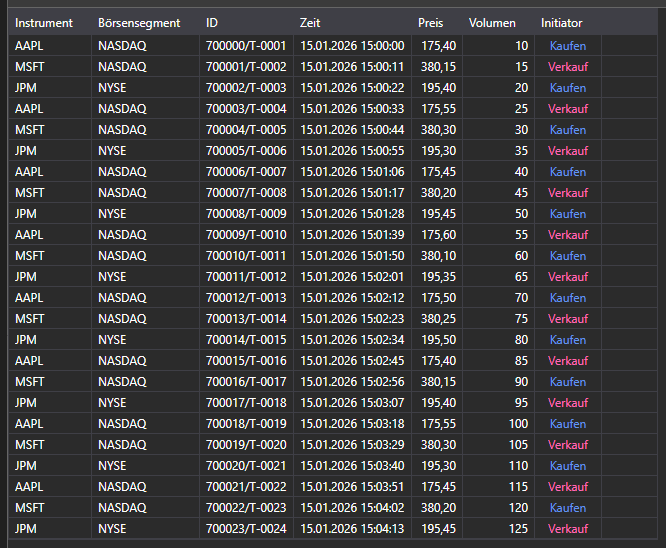

# Tick-Trades



[TradeGrid](xref:StockSharp.Xaml.TradeGrid) - eine Trade-Tabelle.

**Wichtigste Eigenschaften**

- [TradeGrid.Trades](xref:StockSharp.Xaml.TradeGrid.Trades) - Liste der Trades.
- [TradeGrid.SelectedTrade](xref:StockSharp.Xaml.TradeGrid.SelectedTrade) - ausgewählter Trade.
- [TradeGrid.SelectedTrades](xref:StockSharp.Xaml.TradeGrid.SelectedTrades) - ausgewählte Trades.

Die folgenden Codefragmente zeigen die Verwendung:

```xaml
<Window x:Class="Sample.TradesWindow"
	xmlns="http://schemas.microsoft.com/winfx/2006/xaml/presentation"
	xmlns:x="http://schemas.microsoft.com/winfx/2006/xaml"
	xmlns:loc="clr-namespace:StockSharp.Localization;assembly=StockSharp.Localization"
	xmlns:xaml="http://schemas.stocksharp.com/xaml"
	Title="{x:Static loc:LocalizedStrings.Str985}" Height="284" Width="544">
	<xaml:TradeGrid x:Name="TradeGrid" x:FieldModifier="public" />
</Window>
```

```cs
public class TradesWindow
{
	private readonly Connector _connector;
	private readonly Security _security;
	private Subscription _tickSubscription;

	public TradesWindow(Connector connector, Security security)
	{
		InitializeComponent();

		_connector = connector;
		_security = security;

		// Empfangsereignis für Tick-Trades abonnieren
		_connector.TickTradeReceived += OnTickReceived;

		// Subscription auf Tick-Trades erstellen
		_tickSubscription = new Subscription(DataType.Ticks, security);

		// Subscription starten
		_connector.Subscribe(_tickSubscription);
	}

	// Handler für das Empfangsereignis von Tick-Trades
	private void OnTickReceived(Subscription subscription, ITickTradeMessage tick)
	{
		// Prüfen, ob der Trade zu unserer Subscription gehört
		if (subscription != _tickSubscription)
			return;

		// Trade im UI-Thread zu TradeGrid hinzufügen
		this.GuiAsync(() => TradeGrid.Trades.Add(tick));
	}

	// Methode zum Abbestellen beim Schließen des Fensters
	public void Unsubscribe()
	{
		if (_tickSubscription != null)
		{
			_connector.TickTradeReceived -= OnTickReceived;
			_connector.UnSubscribe(_tickSubscription);
			_tickSubscription = null;
		}
	}
}
```

### Eigene Trades anzeigen

```cs
public class MyTradesWindow
{
	private readonly Connector _connector;

	public MyTradesWindow(Connector connector)
	{
		InitializeComponent();

		_connector = connector;

		// Empfangsereignis für eigene Trades abonnieren
		_connector.OwnTradeReceived += OnOwnTradeReceived;

		// Subscription auf Transaktionsdaten erstellen
		var myTradesSubscription = new Subscription(DataType.Transactions, null);

		// Subscription starten
		_connector.Subscribe(myTradesSubscription);
	}

	// Handler für das Empfangsereignis eigener Trades
	private void OnOwnTradeReceived(Subscription subscription, MyTrade myTrade)
	{
		// Eigenen Trade im UI-Thread zu TradeGrid hinzufügen
		this.GuiAsync(() => TradeGrid.Trades.Add(myTrade));
	}
}
```

### Historische Tick-Trades abrufen

```cs
// Methode zum Abrufen historischer Tick-Trades
public void LoadHistoricalTicks(Security security, DateTime from, DateTime to)
{
	// Aktuelle Trades löschen
	TradeGrid.Trades.Clear();

	// Subscription auf historische Tick-Trades erstellen
	var historySubscription = new Subscription(DataType.Ticks, security)
	{
		MarketData =
		{
			// Zeitraum für historische Daten angeben
			From = from,
			To = to
		}
	};

	// Empfangsereignis für Tick-Trades abonnieren
	_connector.TickTradeReceived += OnHistoricalTickReceived;

	// Subscription starten
	_connector.Subscribe(historySubscription);
}

// Handler für das Empfangsereignis historischer Tick-Trades
private void OnHistoricalTickReceived(Subscription subscription, ITickTradeMessage tick)
{
	// Tick im UI-Thread zu TradeGrid hinzufügen
	this.GuiAsync(() =>
	{
		TradeGrid.Trades.Add(tick);

		// Statistik aktualisieren
		UpdateTradeStatistics();
	});
}

// Methode zum Aktualisieren der Trade-Statistik
private void UpdateTradeStatistics()
{
	int totalTrades = TradeGrid.Trades.Count;
	decimal totalVolume = TradeGrid.Trades.Sum(t => t.Volume);
	decimal averagePrice = TradeGrid.Trades.Any()
		? TradeGrid.Trades.Average(t => t.Price)
		: 0;

	// Statistikelemente der Oberfläche aktualisieren
	TotalTradesLabel.Content = $"Trades gesamt: {totalTrades}";
	TotalVolumeLabel.Content = $"Gesamtvolumen: {totalVolume}";
	AveragePriceLabel.Content = $"Durchschnittspreis: {averagePrice:F2}";
}
```

### Trades nach Volumen filtern

```cs
// Methode zum Filtern von Trades nach Mindestvolumen
public void FilterTicksByVolume(decimal minVolume)
{
	// Filterwert speichern
	_minVolumeFilter = minVolume;

	// Handler für das Empfangsereignis von Tick-Trades aktualisieren
	_connector.TickTradeReceived -= OnTickReceived;
	_connector.TickTradeReceived += OnFilteredTickReceived;
}

// Handler für das Empfangsereignis von Tick-Trades mit Volumenfilter
private void OnFilteredTickReceived(Subscription subscription, ITickTradeMessage tick)
{
	// Prüfen, ob der Trade zum ausgewählten Instrument gehört
	if (tick.SecurityId != _security.ToSecurityId())
		return;

	// Volumenfilter anwenden
	if (tick.Volume < _minVolumeFilter)
		return;

	// Trade im UI-Thread zu TradeGrid hinzufügen
	this.GuiAsync(() => TradeGrid.Trades.Add(tick));

	// Bei einem großen Trade kann er hervorgehoben oder eine Benachrichtigung gesendet werden
	if (tick.Volume >= _largeVolumeThreshold)
	{
		NotifyLargeVolumeTrade(tick);
	}
}

// Methode zur Benachrichtigung über große Trades
private void NotifyLargeVolumeTrade(ITickTradeMessage tick)
{
	// Informationen über den großen Trade ausgeben
	Console.WriteLine($"Großer Trade: {tick.SecurityId}, {tick.ServerTime}, Preis: {tick.Price}, Volumen: {tick.Volume}");

	// Akustische oder visuelle Benachrichtigung hinzufügen
	this.GuiAsync(() =>
	{
		// Beispiel für visuelle Hervorhebung in der Liste
		var tradeItem = TradeGrid.Trades.LastOrDefault();
		if (tradeItem != null)
		{
			TradeGrid.SelectedTrade = tradeItem;
			HighlightTrade(tradeItem);
		}
	});
}
```
