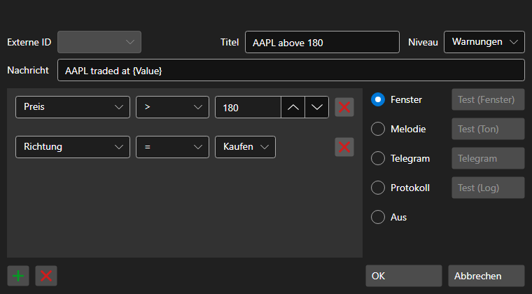

# Fenster für Benachrichtigungseinstellungen

[AlertSettingsWindow](xref:StockSharp.Alerts.AlertSettingsWindow) - Fenster zum Konfigurieren von Benachrichtigungen für bestimmte Ereignisse

Sie können Benachrichtigungen über Änderungen der folgenden Datentypen konfigurieren: Portfolio, Clientcode, Broker, Verwahrstelle, Serverzeit, Transaktion, Datentyp, Stornierung, Order-ID, Order-ID (String), Order-ID (Plattform), Derivat, Derivat (String), Preis, Volumen (Order), Volumen (Trade), sichtbares Volumen, Richtung, Saldo, Ordertyp, Status, Kommentar, Ordernachricht, Systemorder, Ablaufzeit der Order, Ausführungsbedingung, Preis, Trade-Initiator, Open Interest, Fehler, Bedingung, Aufwärtstrend, Kommission, Verzögerung, Slippage, Kennung (Benutzer), Währung, P\/L, Position, Market Maker.

Benachrichtigungen können folgende Formen haben:

- **Window** - ein kleines Popup-Fenster mit einer Nachricht wird in der Bildschirmecke angezeigt.
- **Melody** - die Melodie wird abgespielt.
- **SMS** - eine Nachricht wird per SMS gesendet.
- **Email** - eine Nachricht wird per E-Mail gesendet.
- **Speech** - eine Nachricht wird von der computergenerierten Stimme vorgelesen.
- **Log** - eine Nachricht wird an das Fenster Designer Logs gesendet.
- **Disabled** - eine Benachrichtigung wird nicht angezeigt.
