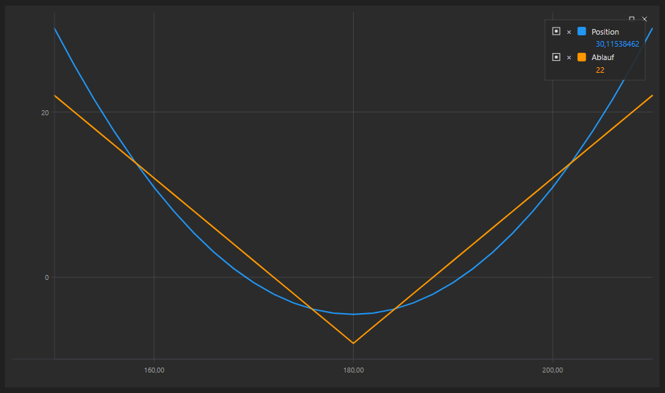

# Positionsdiagramm

Die grafische Komponente [OptionPositionChart](xref:StockSharp.Xaml.Charting.OptionPositionChart) ist ein Diagramm, das die Position und die optionsbezogenen "Greeks" zum Basiswert anzeigt.

Nachfolgend wird das Beispiel SampleOptionQuoting gezeigt, in dem dieses Diagramm verwendet wird. Der Quellcode des Beispiels befindet sich im Ordner *Samples\/06\_Strategies\/09\_LiveOptionsQuoting*.



## Beispiel SampleOptionQuoting

1. Fügen Sie im XAML-Code das Element [OptionPositionChart](xref:StockSharp.Xaml.Charting.OptionPositionChart) hinzu und weisen Sie ihm den Namen **PosChart** zu.

   ```xaml
   <Window x:Class="OptionCalculator.MainWindow"
           xmlns="http://schemas.microsoft.com/winfx/2006/xaml/presentation"
           xmlns:x="http://schemas.microsoft.com/winfx/2006/xaml"
           xmlns:loc="clr-namespace:StockSharp.Localization;assembly=StockSharp.Localization"
           xmlns:xaml="http://schemas.stocksharp.com/xaml"
           Title="{x:Static loc:LocalizedStrings.XamlStr396}" Height="400" Width="1030">
       <Grid Margin="5,5,5,5">
       
   	    .........................................................
   	    
   	    <xaml:OptionPositionChart x:Name="PosChart" Grid.Row="7" Grid.Column="0" Grid.ColumnSpan="6" />
   	</Grid>
   </Window>
   				
   ```

2. Erstellen Sie im C#-Code eine Verbindung und abonnieren Sie die erforderlichen Ereignisse.

   ```cs
   ...                 
   public readonly Connector Connector = new Connector();
   ...                 
   // Ereignis für erfolgreiche Verbindung abonnieren
   Connector.Connected += () =>
   {
   	// GUI-Beschriftungen aktualisieren
   	this.GuiAsync(() => ChangeConnectStatus(true));
   };
   // Ereignis für Trennung abonnieren
   Connector.Disconnected += () =>
   {
   	// GUI-Beschriftungen aktualisieren
   	this.GuiAsync(() => ChangeConnectStatus(false));
   };
   // Ereignis für Verbindungsfehler abonnieren
   Connector.ConnectionError += error => this.GuiAsync(() =>
   {
   	// GUI-Beschriftungen aktualisieren
   	ChangeConnectStatus(false);
   	MessageBox.Show(this, error.ToString(), LocalizedStrings.ErrorConnection);
   });
   // Liste der Basiswerte füllen
   Connector.SecurityReceived += (sub, security) =>
   {
   	if (security.Type == SecurityTypes.Future)
   		_assets.Add(security);
   };
   Connector.Level1Received += (sub, security) =>
   {
   	if (_model.UnderlyingAsset == security || _model.UnderlyingAsset.Id == security.UnderlyingSecurityId)
   		_isDirty = true;
   };
   // Tick-Preise abonnieren und Asset-Preis aktualisieren
   Connector.TickTradeReceived += (sub, trade) =>
   {
   	if (_model.UnderlyingAsset == trade.Security || _model.UnderlyingAsset.Id == trade.Security.UnderlyingSecurityId)
   		_isDirty = true;
   };
   Connector.NewPosition += position => this.GuiAsync(() =>
   {
   	var asset = SelectedAsset;
   	if (asset == null)
   		return;
   	var assetPos = position.Security == asset;
   	var newPos = position.Security.UnderlyingSecurityId == asset.Id;
   	if (!assetPos && !newPos)
   		return;
   	RefreshChart();
   });
   Connector.PositionChanged += position => this.GuiAsync(() =>
   {
   	if ((PosChart.AssetPosition != null && PosChart.AssetPosition == position) || PosChart.Positions.Cache.Contains(position))
   		RefreshChart();
   });
   try
   {
   	if (File.Exists(_settingsFile))
   		Connector.Load(new JsonSerializer<SettingsStorage>().Deserialize(_settingsFile));
   }
   ...
   ```

3. Legen Sie beim Verbinden die anfänglichen Einstellungen des Steuerelements fest:

   1. Zurücksetzen des Modells des Steuerelements [OptionPositionChart.Model](xref:StockSharp.Xaml.Charting.OptionPositionChart.Model); 
   2. Neuzeichnen des Diagramms mit den Anfangswerten [OptionPositionChart.Refresh](xref:StockSharp.Xaml.Charting.OptionPositionChart.Refresh(System.Nullable{System.Decimal},System.Nullable{System.DateTimeOffset},System.Nullable{System.DateTimeOffset}))**(**[System.Nullable\<System.Decimal\>](xref:System.Nullable`1) assetPrice, [System.Nullable\<System.DateTimeOffset\>](xref:System.Nullable`1) currentTime, [System.Nullable\<System.DateTimeOffset\>](xref:System.Nullable`1) expiryDate **)**; 
   3. Angeben des Nachrichtenproviders für Marktdaten und Instrumente.

   ```cs
   private void ConnectClick(object sender, RoutedEventArgs e)
   {
   	if (!_isConnected)
   	{
   		ConnectBtn.IsEnabled = false;
   ...
   		PosChart.Model = null;
   ...
   		PosChart.MarketDataProvider = Connector;
   		PosChart.SecurityProvider = Connector;
   		PosChart.PositionProvider = Connector;
   		Connector.Connect();
   	}
   	else
   		Connector.Disconnect();
   }
   ```

4. Beim Empfang von Instrumenten fügen wir die Basiswerte zur Liste hinzu.

   ```cs
   Connector.SecurityReceived += (sub, security) =>
   {
   	if (security.Type == SecurityTypes.Future)
   		_assets.Add(security);
   };
   ```

5. Wenn sich Level1 des Basisinstruments oder der Optionen ändert und beim Empfang eines neuen Trades setzen wir das Flag \_isDirty. Dadurch kann die Methode RefreshChart (siehe unten) im Timer-Ereignis (Code ausgelassen) aufgerufen werden, um das Diagramm neu zu zeichnen. So steuern wir die Häufigkeit des Neuzeichnens.

   ```cs
   Connector.Level1Received += (sub, security) =>
   {
   	if (_model.UnderlyingAsset == security || _model.UnderlyingAsset.Id == security.UnderlyingSecurityId)
   		_isDirty = true;
   };
   Connector.TickTradeReceived += (sub, trade) =>
   {
   	if (_model.UnderlyingAsset == trade.Security || _model.UnderlyingAsset.Id == trade.Security.UnderlyingSecurityId)
   		_isDirty = true;
   };
   ```

6. Im Ereignishandler für das Auftreten einer neuen Position rufen wir `RefreshChart` auf, um das Diagramm neu zu zeichnen.

   ```cs
   Connector.NewPosition += position => this.GuiAsync(() =>
   {
   	var asset = SelectedAsset;
   	if (asset == null)
   		return;
   	var assetPos = position.Security == asset;
   	var newPos = position.Security.UnderlyingSecurityId == asset.Id;
   	if (!assetPos && !newPos)
   		return;
   	RefreshChart();
   });
   Connector.PositionChanged += position => this.GuiAsync(() =>
   {
   	if ((PosChart.AssetPosition != null && PosChart.AssetPosition == position) || PosChart.Positions.Cache.Contains(position))
   		RefreshChart();
   });
   ```

7. Diese Methode zeichnet das Diagramm neu:

   ```cs
   private void RefreshChart()
   {
   	var asset = SelectedAsset;
   	var trade = asset.LastTrade;
   	if (trade != null)
   		PosChart.Refresh(trade.Price);
   }
   ```

## Empfohlene Inhalte

[Volatilitätshandel](../../options/volatility_trading.md)
