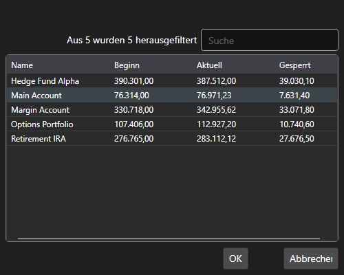

# Fenster zur Portfolioauswahl

[PortfolioPickerWindow](xref:StockSharp.Xaml.PortfolioPickerWindow) ist ein Fenster zur Auswahl eines Portfolios. Das Fenster zeigt eine Liste von Portfolios und Informationen zu den Cash-Positionen der Portfolios an.



**Wichtigste Eigenschaften**

- [PortfolioPickerWindow.Portfolios](xref:StockSharp.Xaml.PortfolioPickerWindow.Portfolios) - Liste der Portfolios.
- [PortfolioPickerWindow.SelectedPortfolio](xref:StockSharp.Xaml.PortfolioPickerWindow.SelectedPortfolio) - das ausgewählte Portfolio.

Unten ist ein Codebeispiel für die Verwendung.

```cs
private void Button_Click(object sender, RoutedEventArgs e)
{
	var wnd = new PortfolioPickerWindow();
	if (Portfolios != null)
		wnd.Portfolios = Portfolios;
	if (wnd.ShowModal(this))
	{
		SelectedPortfolio = wnd.SelectedPortfolio;
	}
}

```
