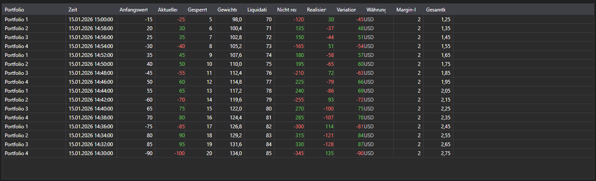

# Positionsänderungen



[PositionChangeGrid](xref:StockSharp.Xaml.PositionChangeGrid) - eine Tabelle für [PositionChangeMessage](xref:StockSharp.Messages.PositionChangeMessage)\-Meldungen. Anders als die Portfoliotabelle zeigt sie nicht den aktuellen Stand, sondern den Änderungsstrom: Jede Zeile ist eine eigene Meldung mit den geänderten Werten.

**Haupteigenschaften**

- [PositionChangeGrid.Messages](xref:StockSharp.Xaml.PositionChangeGrid.Messages) - Liste der Meldungen über Positionsänderungen.
- [PositionChangeGrid.SelectedMessage](xref:StockSharp.Xaml.PositionChangeGrid.SelectedMessage) - ausgewählte Meldung.
- [PositionChangeGrid.SelectedMessages](xref:StockSharp.Xaml.PositionChangeGrid.SelectedMessages) - ausgewählte Meldungen.
- [PositionChangeGrid.MaxCount](xref:StockSharp.Xaml.PositionChangeGrid.MaxCount) - maximale Zeilenzahl der Tabelle; bei Überschreitung werden die ältesten Zeilen entfernt.

Dieser Strom hilft bei der Analyse von Abweichungen: Man sieht, welchen Wert der Connector wann geliefert hat, nicht nur das Endergebnis.

Nachfolgend Codeausschnitte zur Verwendung:

```xaml
<Window x:Class="Sample.PositionChangesWindow"
	xmlns="http://schemas.microsoft.com/winfx/2006/xaml/presentation"
	xmlns:x="http://schemas.microsoft.com/winfx/2006/xaml"
	xmlns:xaml="http://schemas.stocksharp.com/xaml"
	Height="400" Width="900">
	<xaml:PositionChangeGrid x:Name="PositionChangeGrid" />
</Window>
```

```cs
// Positionsänderungen vom Connector empfangen
_connector.PositionReceived += (subscription, position) =>
{
	var message = position.ToChangeMessage();

	// Meldung im Oberflächen-Thread in die Tabelle eintragen
	this.GuiAsync(() => PositionChangeGrid.Messages.Add(message));
};

// Abonnement für Positionsänderungen anlegen
_connector.Subscribe(new Subscription(DataType.PositionChanges));
```

## Siehe auch

[Portfolios](../portfolios.md)
