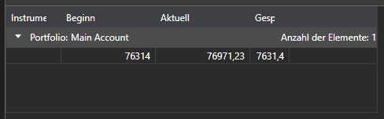

# Tabelle

[PortfolioGrid](xref:StockSharp.Xaml.PortfolioGrid) ist eine Komponente, die den Status von Portfolios und Positionen anzeigt.



**Wichtigste Eigenschaften**

- [PortfolioGrid.Positions](xref:StockSharp.Xaml.PortfolioGrid.Positions) - Liste der Positionen und Portfolios.
- [PortfolioGrid.SelectedPosition](xref:StockSharp.Xaml.PortfolioGrid.SelectedPosition) - die ausgewählte Position.
- [PortfolioGrid.SelectedPositions](xref:StockSharp.Xaml.PortfolioGrid.SelectedPositions) - ausgewählte Positionen.

Das folgende Codebeispiel zeigt die Verwendung. Das Codebeispiel stammt aus *Samples/InteractiveBrokers/SampleIB*.

```xaml
<Window x:Class="Sample.PortfoliosWindow"
		xmlns="http://schemas.microsoft.com/winfx/2006/xaml/presentation"
		xmlns:x="http://schemas.microsoft.com/winfx/2006/xaml"
		xmlns:loc="clr-namespace:StockSharp.Localization;assembly=StockSharp.Localization"
		xmlns:xaml="http://schemas.stocksharp.com/xaml"
		Title="{x:Static loc:LocalizedStrings.Portfolios}" Height="200" Width="470">
	<xaml:PortfolioGrid x:Name="PortfolioGrid" x:FieldModifier="public" />
</Window>

```
```cs

private readonly Connector _connector = new Connector();
private void ConnectClick(object sender, RoutedEventArgs e)
{
	.........................................................
	_connector.PositionReceived += (sub, p) => _portfoliosWindow.PortfolioGrid.Positions.TryAdd(position);
	.........................................................
}

```
