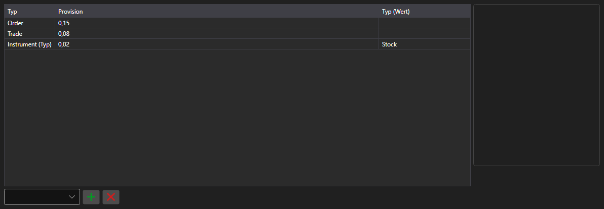

# Provisionsregeln



[CommissionPanel](xref:StockSharp.Xaml.CommissionPanel) - eine Tabelle der Provisionsregeln. Jede Zeile ist eine [ICommissionRule](xref:StockSharp.Algo.Commissions.ICommissionRule)\-Regel: je Abschluss, je Volumen, je Umsatz oder als Prozentsatz der Summe.

**Haupteigenschaften**

- [CommissionPanel.Rules](xref:StockSharp.Xaml.CommissionPanel.Rules) - Liste der Provisionsregeln.

Die Regeln dieser Tabelle werden an den Provisionsmanager übergeben, sodass ein Test auf Historie die Kosten genauso berechnet wie der Echtbetrieb.

Nachfolgend Codeausschnitte zur Verwendung:

```xaml
<Window x:Class="Sample.CommissionWindow"
	xmlns="http://schemas.microsoft.com/winfx/2006/xaml/presentation"
	xmlns:x="http://schemas.microsoft.com/winfx/2006/xaml"
	xmlns:xaml="http://schemas.stocksharp.com/xaml"
	Height="300" Width="700">
	<xaml:CommissionPanel x:Name="CommissionPanel" />
</Window>
```

```cs
// Provision je Abschluss
CommissionPanel.Rules.Add(new CommissionPerTradeRule { Value = 1.5m });

// Provision je Ordervolumen
CommissionPanel.Rules.Add(new CommissionPerOrderVolumeRule { Value = 0.01m });

// Regeln auf den Provisionsmanager anwenden
_connector.CommissionManager.Rules.Clear();
_connector.CommissionManager.Rules.AddRange(CommissionPanel.Rules);
```

## Siehe auch

[Dienstpanels](../service_panels.md)
