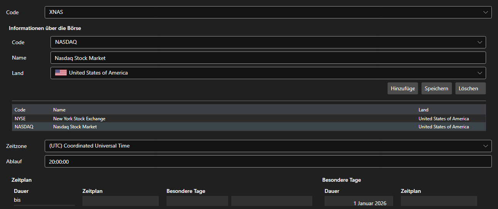

# Börsenplätze



[ExchangeBoardsPanel](xref:StockSharp.Xaml.ExchangeBoardsPanel) - ein Verzeichnis der Handelsplätze [ExchangeBoard](xref:StockSharp.BusinessEntities.ExchangeBoard). Für jeden Platz werden Code, Börse, Zeitzone und Zeitplan festgelegt.

**Haupteigenschaften**

- [ExchangeBoardsPanel.Boards](xref:StockSharp.Xaml.ExchangeBoardsPanel.Boards) - Liste der Plätze.
- [ExchangeBoardsPanel.SelectedBoardCode](xref:StockSharp.Xaml.ExchangeBoardsPanel.SelectedBoardCode) - Code des ausgewählten Platzes.

Der Zeitplan wird mit dem eingebetteten [WorkingTimeControl](xref:StockSharp.Xaml.WorkingTimeControl) bearbeitet. Aus genau diesem Zeitplan erfährt ein Test auf Historie, wann der Platz geöffnet und wann er geschlossen ist.

Nachfolgend Codeausschnitte zur Verwendung:

```xaml
<Window x:Class="Sample.BoardsWindow"
	xmlns="http://schemas.microsoft.com/winfx/2006/xaml/presentation"
	xmlns:x="http://schemas.microsoft.com/winfx/2006/xaml"
	xmlns:xaml="http://schemas.stocksharp.com/xaml"
	Height="500" Width="800">
	<xaml:ExchangeBoardsPanel x:Name="BoardsPanel" />
</Window>
```

```cs
// Platz auswählen
BoardsPanel.SetBoardCode(ExchangeBoard.MicexTqbr.Code);

// Änderung des Verzeichnisses vermerken
BoardsPanel.Changed += () => _isModified = true;

// Plätze speichern
foreach (var board in BoardsPanel.Boards)
	_exchangeInfoProvider.Save(board);
```

## Siehe auch

[Dienstpanels](../service_panels.md)
