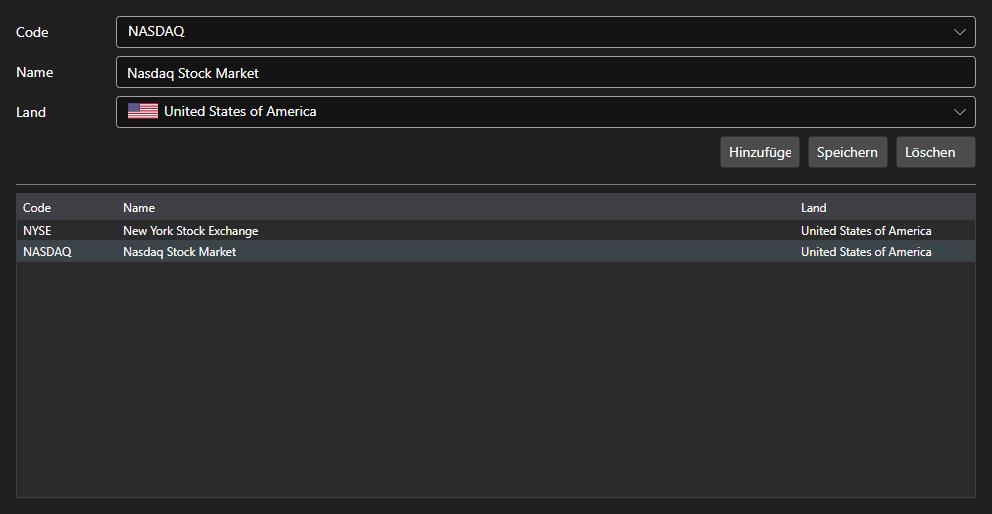

# Börsen



[ExchangesPanel](xref:StockSharp.Xaml.ExchangesPanel) - ein Verzeichnis der Börsen. Es zeigt die Liste der [Exchange](xref:StockSharp.BusinessEntities.Exchange)\-Einträge mit Name und Land und erlaubt das Anlegen eigener Börsen.

**Haupteigenschaften**

- [ExchangesPanel.Exchanges](xref:StockSharp.Xaml.ExchangesPanel.Exchanges) - Liste der Börsen [Exchange](xref:StockSharp.BusinessEntities.Exchange).
- [ExchangesPanel.SelectedExchangeName](xref:StockSharp.Xaml.ExchangesPanel.SelectedExchangeName) - Name der ausgewählten Börse.

Das Panel steht üblicherweise zusammen mit [ExchangeBoardsPanel](xref:StockSharp.Xaml.ExchangeBoardsPanel): Die hier gewählte Börse bestimmt, welche Börsenplätze dort erscheinen. Über den Wechsel der Auswahl informiert das Ereignis `SelectedExchangeChanged`.

Nachfolgend Codeausschnitte zur Verwendung:

```xaml
<Window x:Class="Sample.ExchangesWindow"
	xmlns="http://schemas.microsoft.com/winfx/2006/xaml/presentation"
	xmlns:x="http://schemas.microsoft.com/winfx/2006/xaml"
	xmlns:xaml="http://schemas.stocksharp.com/xaml"
	Height="400" Width="600">
	<xaml:ExchangesPanel x:Name="ExchangesPanel" />
</Window>
```

```cs
// Börse auswählen
ExchangesPanel.SetExchange(Exchange.Moex.Name);

// Auswahl des Börsenplatzes beim Wechsel zurücksetzen
ExchangesPanel.SelectedExchangeChanged += () =>
	BoardsPanel.SetBoardCode(null);

// Verzeichnis speichern
foreach (var exchange in ExchangesPanel.Exchanges)
	_exchangeInfoProvider.Save(exchange);
```

## Siehe auch

[Dienstpanels](../service_panels.md)
