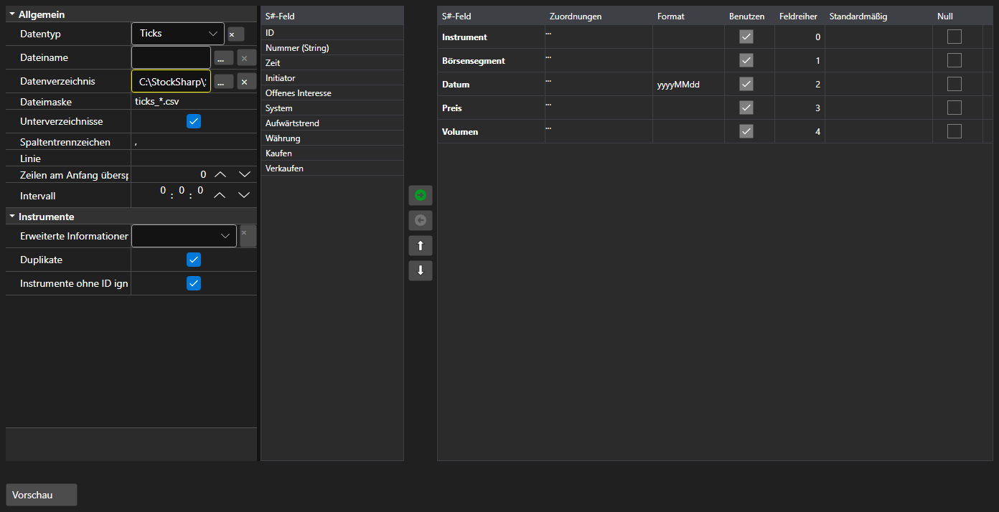

# Importeinstellungen



[ImportSettingsPanel](xref:StockSharp.Xaml.ImportSettingsPanel) - ein Panel zur Konfiguration des Datenimports aus einer Textdatei. Es legt Trennzeichen, Datums\- und Zeitformat, Kodierung und vor allem die Auswahl und Reihenfolge der Spalten fest.

**Haupteigenschaften**

- [ImportSettingsPanel.Settings](xref:StockSharp.Xaml.ImportSettingsPanel.Settings) - Importeinstellungen.
- [ImportSettingsPanel.SelectedFields](xref:StockSharp.Xaml.ImportSettingsPanel.SelectedFields) - ausgewählte Felder in der Reihenfolge, in der sie in der Datei stehen.
- [ImportSettingsPanel.UnSelectedFields](xref:StockSharp.Xaml.ImportSettingsPanel.UnSelectedFields) - Felder, die in der Datei nicht vorkommen.

Felder werden zwischen den beiden Listen verschoben und nach oben oder unten bewegt, bis ihre Reihenfolge der Spaltenreihenfolge in der Datei entspricht. Die Methode [ImportSettingsPanel.HasErrors](xref:StockSharp.Xaml.ImportSettingsPanel.HasErrors) prüft die Einstellungen vor dem Start.

Nachfolgend Codeausschnitte zur Verwendung:

```xaml
<Window x:Class="Sample.ImportWindow"
	xmlns="http://schemas.microsoft.com/winfx/2006/xaml/presentation"
	xmlns:x="http://schemas.microsoft.com/winfx/2006/xaml"
	xmlns:xaml="http://schemas.stocksharp.com/xaml"
	Height="600" Width="900">
	<xaml:ImportSettingsPanel x:Name="ImportPanel" />
</Window>
```

```cs
// Import von Tickdaten konfigurieren
ImportPanel.Settings = new ImportSettings(DataType.Ticks, fields);

// Import mit fehlerhaften Einstellungen nicht starten
if (ImportPanel.HasErrors())
	return;

// Parser aus den konfigurierten Feldern erzeugen
var parser = new CsvParser(ImportPanel.Settings.DataType, ImportPanel.SelectedFields);
```

## Siehe auch

[Dienstpanels](../service_panels.md)
